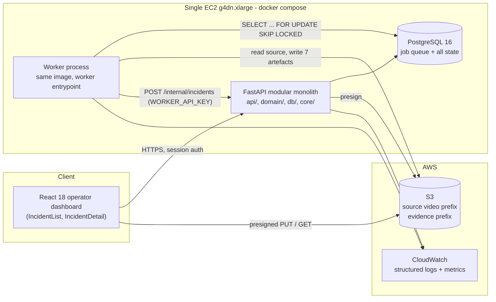
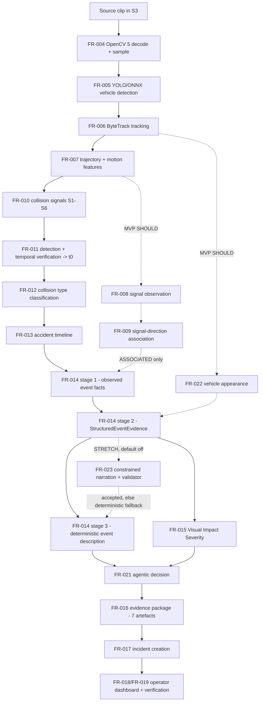
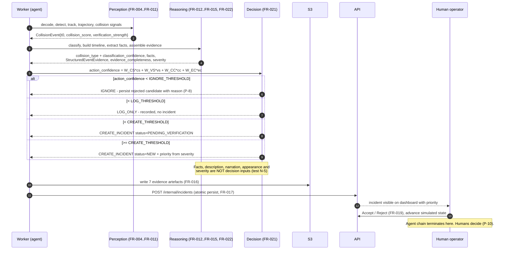
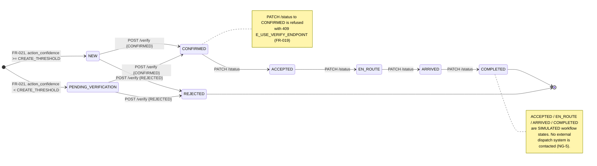

CrashSense AI — Software Specification
Document: SPEC.md Version: 0.4.1 (consolidated) Status: Implementation-ready Scope: 8-week hackathon build · 2 contributors Supersedes: v0.1, v0.2, v0.2.1, v0.3 and all interim patches

§0 Document Control
§0.1 Founding Principles (binding, unchanged since v0.1)

#	Principle
P-1	Modular monolith. One FastAPI application, one worker process, clear module boundaries. No microservices, no service mesh, no queue broker beyond the database.
P-2	Explicit UNKNOWN. Any value the system cannot establish is returned as UNKNOWN with a machine-readable reason_code. Silence, null-as-guess, and imputation are prohibited.
P-3	Full evidence traceability. Every claim the system displays resolves to a stored measurement. A claim without a measurement is a defect.
P-4	No legal-fault claims anywhere. No output, label, field, log line, UI string, report or demo sentence may assert cause, fault, liability, violation or responsibility.
P-5	Original AI output is never overwritten. Operator corrections are stored alongside, never in place of, original_ai_output. This survives schema migration.
P-6	config_hash + model_version on every incident. Any analysis is reproducible from its recorded configuration.
P-7	Deterministic reasoning. All MVP reasoning is a pure function of its inputs: no randomness, no network, no clock, no learned weights.
P-8	Rejected candidates are persisted. A candidate the agent chose to ignore is stored with its score breakdown and rejection reason.
P-9	Evidence package or it did not happen. Every incident ships 7 replayable artefacts.
P-10	Human-in-the-loop. The system routes, prioritises and describes. Humans decide.
P-11	Substantive OpenCV 5 usage. OpenCV performs real work in decoding, HSV signal analysis, optical flow, appearance extraction and annotated rendering — not a decorative dependency.
P-12	TBD-BASELINE over invention. Any threshold or target not yet measured is written TBD-BASELINE. No provisional number is asserted anywhere in this document.
§0.2 Requirement Tiers

Tier	Meaning
MVP MUST	The demo does not exist without it. Blocks the Definition of Done.
MVP SHOULD	Built if Phase capacity allows. Degrades cleanly to UNKNOWN or absence. Never load-bearing.
STRETCH	Built only after all MVP MUST items are green. Default-off. Removable without touching another module.
V2	Explicitly out of scope. Recorded to prevent scope creep.
§0.3 Version History

Version	Summary
0.1	Initial specification.
0.2	Scope reduction: severity redefined as Visual Impact Severity; medical/injury severity removed; RTSP demoted to STRETCH; multi-camera fusion moved to V2.
0.2.1	Consistency patch: motorcycle demoted to STRETCH behind a Phase 0 dataset-sufficiency gate; severity disclaimer made mandatory on every rendering surface; responder workflow states declared simulated.
0.3	Terminology and contract patch toward observation-only reasoning.
0.4	Architectural replacement. The Cause-Analysis feature is deleted — requirement, rule engine, taxonomy, storage, API surface, UI panel, tests and evaluation metric — and replaced by FR-014 Accident Event Reconstruction & Explanation. Vehicle appearance (FR-022) and constrained LLM narration (FR-023) added. Evaluation replaced by five grounding-oriented measures.
0.4.1	Team-size correction: reduced from 3 contributors to 2 (Dev 1 CV/AI, Dev 2 platform). Member 3-owned artefacts reassigned; EE-E rater protocol changed to a single external non-contributor rater with downgrade-on-disagreement, replacing the three-person adjudication model.
Legacy-name carve-out. Superseded identifiers from v0.1–v0.3 appear in exactly two places in this document, both outside the MVP product path and outside the implementation: the reference-only historical upgrade material in Appendix A (a DROP statement must name what it drops) and the repo-wide grep test F-9 in §32 (a guard must name what it forbids). They exist nowhere else, in no product surface, and in no runtime code path.

§0.4 Terminology

Term	Definition
Observed Event Fact	A single measurement-backed statement about vehicle motion or geometry, drawn from the closed EventFactType enum (§12.1). An observation, never a conclusion.
Structured Event Evidence	The machine-readable projection of all observations for one collision (§12.3). The single input contract to description generation.
Event Description	The natural-language paragraph describing what was observed, produced deterministically (§12.6) or, optionally, by a constrained narrator (FR-023).
Accident Timeline	The chronologically ordered list of observed events (§11.2), sharing the EventFactType vocabulary.
Visual Impact Severity	A heuristic band (LOW/MODERATE/HIGH/UNKNOWN) describing visible collision mechanics only. Never a medical or injury assessment.
relative_speed_proxy	An internal, scale-normalised motion magnitude used for reasoning and evidence. Never displayed to a user, never expressed in physical units.
t0	Impact timestamp. All event offsets are expressed as time_offset_s relative to t0.
Simulated responder workflow	Dashboard-only lifecycle states modelling operator intent. No external dispatch system exists or is contacted.
§0.5 TBD-BASELINE Policy
A value written TBD-BASELINE is unmeasured. It must be resolved to a measured value, recorded in docs/evaluation/, before it appears in any published artefact — Devpost submission, pitch deck, report or demo narration. Publishing a TBD-BASELINE value as a result is a Definition-of-Done failure.

§1 Product Overview
§1.1 Problem
CCTV networks record collisions that nobody watches. Review is manual, retrospective and inconsistent. Operators triaging footage need to know, quickly: did a collision occur, how hard was it, and what happened in the seconds around it — with the evidence attached.

§1.2 Solution
CrashSense AI analyses recorded CCTV clips, detects vehicle collisions, reconstructs what was visually observed before, during and immediately after impact, packages replayable evidence, and autonomously routes the result to a human operator dashboard with a priority derived from visible impact mechanics.

It describes. It does not adjudicate.

§1.3 Goals

ID	Goal	Tier
G-1	Detect vehicle collisions in recorded CCTV video, precision-first	MVP MUST
G-2	Produce a machine-readable reconstruction: tracks, trajectories, timeline, collision type	MVP MUST
G-3	Autonomously decide — from accident confidence alone — whether to ignore, log, request verification, or create an incident	MVP MUST
G-4	Deliver every incident with a replayable evidence package	MVP MUST
G-5	Describe what was visually observed before, during and immediately after the collision, using only measurement-backed observations. Never state or imply cause, fault or responsibility	MVP MUST
G-6	Estimate Visual Impact Severity from visible collision mechanics, used only to prioritise already-confirmed incidents	MVP MUST
G-7	Where a camera is manually configured with signal geometry, report the observed signal state governing a vehicle at the stop line	MVP SHOULD
G-8	Estimate simple vehicle appearance (type, colour) so descriptions are human-readable	MVP SHOULD
§1.4 Non-Goals

ID	Non-goal
NG-1	Pedestrian, cyclist, animal or human-fall detection. Vehicles only
NG-2	Medical or injury severity, casualty count, triage advice, required medical resources
NG-3	Legal fault, liability, insurance adjudication, citation generation
NG-4	Licence-plate recognition, driver or face identification, cross-camera re-identification
NG-5	Real emergency-dispatch integration. Responder states are simulated workflow states (§17.2)
NG-6	Absolute speed in km/h or mph. Speed is internal, scale-normalised and comparative
NG-7	Live 24/7 multi-camera scale, multi-camera fusion, edge deployment
NG-8	Learned collision, event or severity models. MVP reasoning is deterministic and rule-based
NG-9	Cause determination, contributing-factor inference, traffic-law violation detection, right-of-way adjudication, or any judgement about driver behaviour, intent, attention or obligation. The system reports observations; it does not explain why
§1.5 Primary Use Case · MVP MUST
An administrator uploads a CCTV clip from a registered camera. The worker analyses it, detects a collision at t0, and — because accident confidence is high — autonomously creates an incident. Within seconds the operator sees a new incident with a map pin, a 10-second clip centred on impact, an accident timeline, collision type T_BONE with its geometric evidence, Visual Impact Severity HIGH with feature contributions and its mandatory disclaimer, the involved vehicles listed as Vehicle A — white car and Vehicle B — dark-coloured car, a list of Observed Event Facts each expandable to its underlying measurements, and a plain-language Event Explanation describing what happened chronologically. The operator watches the clip, clicks Accept, and moves the incident to EN_ROUTE — a simulated workflow state. At no point does the system state why the collision occurred or attribute fault.

§1.6 Secondary Use Case — Signal-Observed Intersection · MVP SHOULD
On the single manually configured demo intersection (§10.5), the same flow additionally reports the observed fact TRAFFIC_SIGNAL_RED for the one vehicle whose direction was successfully associated with a signal — rendered as "Vehicle B entered the intersection while its associated traffic signal was red." — with the five association preconditions and the exact evidence keys shown in the UI. The description stops there. No violation is asserted. On every other camera no traffic-signal fact is emitted at all, and the signal panel reads UNKNOWN — reason: NO_SIGNAL_CONFIGURED.

§1.7 MVP Scope
File-based ingestion · YOLO vehicle detection (car/bus/truck; motorcycle STRETCH) · ByteTrack tracking · trajectory extraction · Baseline B multi-signal collision detection with temporal verification · 7-class collision classification including UNKNOWN · accident timeline reconstruction · deterministic observed-event extraction · Structured Event Evidence assembly · deterministic event description · vehicle appearance estimation (MVP SHOULD) · Visual Impact Severity · 7-artefact evidence packaging to S3 · FastAPI modular monolith + PostgreSQL · React operator dashboard · single GPU EC2 + S3 + CloudWatch · agentic decision engine with human-in-the-loop routing.

Out of MVP: RTSP ingestion (STRETCH, FR-024) · LLM narration (STRETCH, FR-023) · Enhanced-tier collision detection (STRETCH) · multi-camera fusion (V2) · learned models (V2) · mobile app (V2).

§2 Personas & Roles

Role	Description	Capabilities
Administrator	Configures the system	Register cameras, configure signal geometry (§10.5), upload clips, manage users, view all incidents
Operator	Reviews and triages incidents	View dashboard, replay evidence, verify (Accept/Reject), advance simulated responder states, add notes
Evaluator (internal)	Dev 1	Runs evaluation harness, annotates the demo set, signs off TBD-BASELINE resolutions and the motorcycle sufficiency decision
Agent (non-human)	The autonomous pipeline	Perceives, reasons, decides, acts — bounded by §14 thresholds and always routed to a human
§3 System Overview



Deliberate simplifications: no message broker (PostgreSQL SELECT … FOR UPDATE SKIP LOCKED is the queue) · no container orchestration (docker compose on one instance) · no CDN (presigned S3 URLs) · no separate cache tier · Postgres runs in the same compose stack, with a nightly pg_dump to S3.

§4 Technology Stack

Layer	Choice	Notes
API	Python 3.11, FastAPI, Pydantic v2	Modular monolith
Worker	Python 3.11, same image, different entrypoint	Polls DB job table
DB	PostgreSQL 16, SQLAlchemy 2.0, Alembic	JSONB for evidence structures
CV — decode/render	OpenCV 5	Decoding, frame sampling, HSV analysis, morphology, optical flow, appearance extraction, annotated clip rendering
CV — detection	YOLO exported to ONNX, ONNX Runtime	CUDA EP → CPU EP fallback
CV — tracking	ByteTrack	Pure Python, no extra runtime
Frontend	React 18, TypeScript, Vite, TanStack Query, Tailwind, MapLibre	
Narration (STRETCH)	Provider-agnostic LLM client behind one interface	Default disabled
Infra	Single EC2 g4dn.xlarge, S3, CloudWatch, docker compose	
CI	GitHub Actions: lint, type-check, unit, contract, migration tests	Build Gate §29
§5 Repository Structure


crashsense/
├── backend/
│   └── app/
│       ├── api/                  # routers: cameras, videos, incidents, internal, health
│       ├── domain/
│       │   ├── incidents.py
│       │   ├── decision.py       # FR-021 agentic decision engine
│       │   ├── severity.py       # FR-015 + SEVERITY_DISCLAIMER constant
│       │   └── event_explanation.py   # FR-014 orchestration
│       ├── db/                   # models, session, migrations/
│       └── core/                 # config, auth, logging, metrics
├── ai/
│   ├── ingest/                   # decode.py, sampler.py
│   ├── detect/                   # yolo_onnx.py
│   ├── track/                    # bytetrack.py
│   ├── trajectory/               # buffers.py, features.py
│   ├── signals/                  # signal_state.py, signal_association.py
│   ├── collision/                # signals_s1_s6.py, detector.py, classifier.py
│   ├── features/                 # appearance.py  (FR-022)
│   ├── timeline/                 # builder.py     (FR-013)
│   └── reasoning/
│       ├── event_extractors.py           # FR-014 stage 1
│       ├── structured_event_evidence.py  # FR-014 stage 2
│       ├── event_description_template.py # FR-014 stage 3 (deterministic, default)
│       ├── narration_llm.py              # FR-023 (STRETCH, default off)
│       └── narration_validator.py        # shared V-1…V-6 gate
├── config/
│   ├── event_extractors.yaml
│   ├── thresholds.yaml
│   └── severity_weights.yaml
├── frontend/
│   └── src/
│       ├── components/
│       │   ├── EventExplanationPanel.tsx
│       │   ├── ObservedEventFactList.tsx
│       │   ├── AccidentTimeline.tsx
│       │   ├── VehicleAppearanceRow.tsx
│       │   ├── SignalObservationChip.tsx
│       │   └── SeverityBadge.tsx
│       └── constants/disclaimers.ts
├── worker/
├── docs/evaluation/
└── tests/
§6 Processing Pipeline



Canonical architecture line: Detection → Tracking → Trajectory → Collision Detection → Timeline → Observed Event Facts → Structured Event Evidence → Event Description

§7 Ingestion (FR-001 – FR-004, FR-024)
FR-001 — Camera Registry · MVP MUST
Cameras are registered with name, latitude, longitude, orientation_deg, timezone, active. Every video and incident references a registered camera. Deleting a camera with incidents is rejected with 409 E_CAMERA_IN_USE. Acceptance: an incident always resolves to a camera with coordinates; the dashboard map never renders a pin without a registered camera.

FR-002 — Video Upload · MVP MUST
POST /api/videos returns a presigned S3 PUT plus a video_id. Client uploads directly to S3, then calls POST /api/videos/{id}/analyze. Constraints: ALLOWED_VIDEO_EXT, UPLOAD_MAX_BYTES, MAX_CLIP_SECONDS. Acceptance: rejected uploads return a typed error code; no partial video ever enters the job queue.

FR-003 — Job Queue & Worker Lifecycle · MVP MUST
Jobs are rows in analysis_jobs. The worker claims with SELECT … FOR UPDATE SKIP LOCKED, sets RUNNING, heartbeats, and terminates in SUCCEEDED/FAILED/FAILED_PERMANENT. Retries: JOB_MAX_ATTEMPTS with exponential backoff. A crashed worker's stale job is reclaimed after JOB_HEARTBEAT_TIMEOUT_S. Acceptance: no job is processed twice concurrently; every terminal state carries a reason_code.

FR-004 — Decoding & Frame Sampling · MVP MUST
OpenCV 5 decodes to TARGET_FPS, downscaling to FRAME_MAX_WIDTH preserving aspect. Frame index ↔ timestamp mapping is exact and stored. Variable-frame-rate sources are normalised. Acceptance: t0 computed on sampled frames maps back to a source timestamp within one sampled-frame interval; corrupt files fail with E_DECODE_FAILED and never crash the worker.

FR-024 — RTSP Live Ingestion · STRETCH
A continuous RTSP reader with a rolling in-memory buffer, emitting the same frames → pipeline contract as FR-004. Default off (RTSP_ENABLED=false). Constraint: RTSP must reuse the FR-004 downstream contract without modification. If it cannot, it is dropped. File-based ingestion remains the MVP path and the demo path.

§8 Detection & Tracking
FR-005 — Vehicle Detection · MVP MUST
Processing. YOLO exported to ONNX, executed via ONNX Runtime with CUDA EP → CPU EP fallback. Confidence gate DET_CONF_THRESHOLD, NMS at DET_NMS_IOU.

Primary MVP classes: car (COCO 2), bus (5), truck (7). Optional class (STRETCH): motorcycle (COCO 3), enabled only via MOTORCYCLE_ENABLED=true (default false). Conditional class: traffic_light (9), captured only when signal analysis is enabled (FR-008).

Motorcycle gate. Phase 0 dataset inspection records motorcycle instance counts, clip counts and collision-involved clip counts per split into docs/evaluation/class_coverage.md. Motorcycle is promoted from STRETCH to MVP SHOULD only if it clears the sufficiency thresholds agreed at Phase 0 exit (TBD-BASELINE). Until that check passes and is signed off by Dev 1, motorcycle remains off by default and is excluded from every acceptance gate. Rationale: unverified evaluated coverage, small-bbox instability in normalisation, higher occlusion and ID-switch rates — none of which we can currently quantify, and none of which we will assert without measurement.

Acceptance criteria.

Detection quality measured on the Phase 0 baseline set over car/bus/truck only; target TBD-BASELINE. No mAP figure is asserted.
With MOTORCYCLE_ENABLED=false, motorcycle detections are dropped before tracking and never appear in vehicles, timeline, evidence, or incident vehicle lists.
With MOTORCYCLE_ENABLED=true, motorcycle results are computed and reported separately as diagnostic-only, excluded from headline metrics (§24.1).
Deterministic across runs; empty detection lists remain valid.
FR-006 — Multi-Object Tracking · MVP MUST
ByteTrack over detections. Parameters TRACK_MAX_AGE, TRACK_MIN_HITS, TRACK_MATCH_IOU. Track IDs are stable within a clip and never reused after termination. Acceptance: ID switches measured on the team-labelled MOT subset (§21); target TBD-BASELINE · re-running a clip yields identical track IDs · a clip with zero detections produces zero tracks and a valid, empty analysis.

§9 Trajectory Extraction
FR-007 — Trajectory Extraction · MVP MUST
Processing. For each track, maintain a rolling buffer of TrajectoryPoint{frame_idx, t_s, cx, cy, w, h, bbox_diag}. Derived per-frame features:


Feature	Definition
speed_norm	Centroid displacement per second, divided by bbox_diag — scale-normalised, internal only
heading_deg	Direction of the smoothed displacement vector
heading_delta_deg	Heading change over TRAJ_SMOOTH_WINDOW
accel_norm	First derivative of speed_norm
relative_speed_proxy	Windowed mean speed_norm, internal only
orientation_deg	Box orientation — Enhanced tier only, STRETCH
Smoothing uses a centred moving average of TRAJ_SMOOTH_WINDOW. Tracks with total displacement_px < MIN_DISPLACEMENT_PX are treated as stationary and emit no direction facts.

Exposure rule (binding). speed_norm, accel_norm and relative_speed_proxy are internal reasoning and evidence values. They are persisted in structured_event_evidence and tracks.json for traceability, and they are never rendered to a user, never sent to the narrator, and never expressed in any unit — physical or normalised. User-facing motion is always comparative language (§12.6). There is no user-facing speed measurement in this product.

Acceptance criteria.

speed_norm is validated on car/bus/truck geometry only. When MOTORCYCLE_ENABLED=true, motorcycle tracks carry normalization_confidence: "LOW" in tracks.json and their kinematic features are excluded from Baseline B collision scoring gates unless MOTORCYCLE_COLLISION_SCORING=true (STRETCH, default false).
Feature computation is deterministic and side-effect free.
A track shorter than TRAJ_SMOOTH_WINDOW yields null derived features — never zero-as-guess.
No unit string (km/h, mph, kph, vehicle-lengths, px/s) appears in any user-facing payload field (tests FE-15, FE-17).
§10 Traffic Signal Observation · MVP SHOULD
FR-008 — Signal State Detection · MVP SHOULD
Processing. Within each manually configured signal ROI, OpenCV 5 converts to HSV and scores red/yellow/green masks with morphological opening. A state is emitted only if one channel dominates by SIGNAL_DOMINANCE_RATIO and exceeds SIGNAL_MIN_CONF, after temporal smoothing over SIGNAL_SMOOTH_FRAMES. Output. SignalObservation{signal_id, state ∈ {RED,YELLOW,GREEN,UNKNOWN}, confidence, frame_idx}. Acceptance: an unconfigured camera runs the pipeline with zero signal work and zero warnings · ambiguous or occluded signals return UNKNOWN, never a guess.

FR-009 — Signal ↔ Direction Association · MVP SHOULD
Five mandatory preconditions, all required:

A camera_signals row exists for this camera.
A stop-line geometry is configured for the approach.
An approach-zone polygon is configured.
Exactly one signal candidate governs the vehicle's bearing within SIGNAL_ASSOC_MAX_BEARING_DEG. Multiple candidates are never tie-broken — the result is AMBIGUOUS_MULTIPLE.
The vehicle's speed_norm at the stop line exceeds SIGNAL_ASSOC_MIN_SPEED_NORM and its track passes through the approach zone.
Output.

python


class SignalAssociation(BaseModel):
    track_id: int
    signal_id: UUID | None
    state_at_stopline: Literal["RED","YELLOW","GREEN","UNKNOWN"]
    t_stopline_offset_s: float | None
    confidence: float
    reason_code: Literal[
        "ASSOCIATED","NO_SIGNAL_CONFIGURED","NO_STOPLINE","NO_APPROACH_ZONE",
        "AMBIGUOUS_MULTIPLE","BEARING_MISMATCH","LOW_SPEED","ZONE_MISS","LOW_CONFIDENCE"]
UNKNOWN lives here and only here. The UNKNOWN state and its reason_code belong to the signal-association layer. They are surfaced in the API as traffic_signal_observation and in the UI as a reason chip. UNKNOWN is not an event fact and has no member in EventFactType.

Terminal contract. The association result is consumed by exactly one downstream consumer — extractor E-9 (§12.2) — which emits an observed fact and nothing else.


Permitted	Prohibited
Fact TRAFFIC_SIGNAL_RED with evidence_keys	Any violation, breach or infringement label
"Vehicle B entered the intersection while its associated traffic signal was red."	"Vehicle B ran a red light."
Timeline row TRAFFIC_SIGNAL_RED @ −0.4s	"Vehicle B violated the signal."
—	"Vehicle B caused the collision by entering on red."
There is no code path from a signal observation to a conclusion about fault, violation or responsibility. No such enum member, column, field or function exists; test F-10 asserts this structurally.

Acceptance criteria. A detected RED with reason_code != ASSOCIATED produces no signal fact and renders UNKNOWN + reason in the UI (F-6) · a camera with no camera_signals row produces zero signal facts (EX-4) · association precision measured on the annotated demo intersection; target TBD-BASELINE, precision-first — low recall is expected and acceptable.

§10.5 Manual Camera Signal Configuration · MVP SHOULD
Signal geometry is configured manually, per camera, by an administrator through an annotation screen: signal ROI polygons, stop-line segments, approach-zone polygons, and the bearing each signal governs. There is no automatic signal discovery, no learned geometry, and no cross-camera transfer.

Scope for the hackathon: exactly one demo intersection is configured. This is disclosed on-screen during the demo and in the Devpost submission (§23.2, §33.2).

§11 Collision Detection, Classification & Timeline
§11.1 Collision Signals & Detection Tiers
FR-010 — Collision Signal Computation · MVP MUST
Six signals per candidate track pair, per frame:


Signal	Measure	Tier
S1	Bounding-box overlap / IoU spike	Baseline A
S2	Inter-centroid distance minimum and closing rate	Baseline A
S3	Acceleration/deceleration magnitude spike (accel_norm)	Baseline B
S4	Abrupt heading change	Baseline B
S5	Local optical-flow divergence (OpenCV 5 Farnebäck)	Baseline B
S6	Trajectory convergence / predicted-path intersection	Baseline B
Each signal is normalised to [0,1]; collision_score = Σ Wᵢ·Sᵢ, weights in config/thresholds.yaml, all TBD-BASELINE. W_S1 … W_S6 must be non-negative and sum to 1.0, so collision_score ∈ [0,1] and is directly comparable to COLLISION_SCORE_THRESHOLD. Validated at start-up (§14.3, test DEC-1).

FR-011 — Collision Detection & Temporal Verification · MVP MUST
Tiers. COLLISION_TIER ∈ {A, B, ENHANCED}; Baseline B is the MVP default. Baseline A is the fallback if the §29 Build Gate fails. ENHANCED (adds orientation and dense flow) is STRETCH.

Two candidate paths. A candidate is raised on exactly one of two paths, recorded as candidate_path.

Pair path (PAIR) — two or more tracks. A candidate fires when collision_score ≥ COLLISION_SCORE_THRESHOLD, where collision_score is the FR-010 weighted sum over S1…S6.

Single-track path (SINGLE_TRACK) — one track, no second vehicle. S1, S2 and S6 are pairwise measures and are not computed, not imputed and not substituted. The candidate is raised from the non-pairwise signals only:

```text
single_vehicle_score = W_SV_S3·S3       # abrupt deceleration magnitude (accel_norm)
                     + W_SV_S4·S4       # abrupt heading change
                     + W_SV_S5·S5       # local optical-flow divergence (Farnebäck)
                     + W_SV_PS·PS       # post-event kinematic settle: stop or sustained
                                        # speed_norm collapse within VERIFY_WINDOW_S

W_SV_S3 + W_SV_S4 + W_SV_S5 + W_SV_PS = 1.0   (validated at start-up, §14.3)
Each of S3, S4, S5, PS ∈ [0,1]  ⇒  single_vehicle_score ∈ [0,1]
```

A single-track candidate fires when single_vehicle_score ≥ SINGLE_VEHICLE_SCORE_THRESHOLD. It is persisted in collision_candidates with candidate_path = 'SINGLE_TRACK' and its own breakdown; collision_score for such a candidate is single_vehicle_score, and signal_breakdown records S1, S2 and S6 as null — never as zero-as-guess (P-2).

Tier coupling (binding). S3, S4 and S5 are Baseline B signals. The single-track path therefore requires COLLISION_TIER ∈ {B, ENHANCED}. Under COLLISION_TIER=A no SINGLE_TRACK candidate is raised and no SINGLE_VEHICLE collision is reported.

Temporal verification (both paths). The elevated score must persist across VERIFY_MIN_FRAMES within VERIFY_WINDOW_S, and post-impact kinematics must be consistent. t0 is the frame of peak score on the path that raised the candidate.

verification_strength (binding definition). Deterministic, bounded, no learned weights:

```text
frame_ratio     = min(1.0, persisted_frames / VERIFY_MIN_FRAMES)
kinematic_ratio = satisfied_post_impact_conditions / 3
                  # the three conditions are: deceleration, separation, stop.
                  # For SINGLE_TRACK, separation is not applicable and the
                  # denominator is 2 (deceleration, stop).

verification_strength = W_VER_FRAMES·frame_ratio + W_VER_KINEMATIC·kinematic_ratio
W_VER_FRAMES + W_VER_KINEMATIC = 1.0   (validated at start-up, §14.3)
```

Both terms are ratios in [0,1] and the weights sum to 1.0, so verification_strength ∈ [0,1] by construction. It is a pure function of counted frames and boolean kinematic conditions: no clock, no randomness, no network (P-7).

Precision-first. Unverified candidates are rejected and persisted in collision_candidates with their full score breakdown and rejection_reason (P-8).

Output. CollisionEvent{t0, t0_frame_idx, track_ids, candidate_path, collision_score, signal_breakdown, verification_strength}.

Acceptance: collision precision/recall measured on the Phase 0 evaluation split; targets TBD-BASELINE, precision prioritised · every rejected candidate is queryable with its reason · deterministic across runs.

FR-012 — Collision Type Classification · MVP MUST
Taxonomy (7 values): REAR_END · T_BONE · HEAD_ON · SIDESWIPE · SINGLE_VEHICLE · MULTI_VEHICLE · UNKNOWN.

Processing. Deterministic geometry: relative heading angle theta_deg at t0, contact-zone inference from box geometry, and vehicle count. Angle bands are configured (TBONE_MIN_ANGLE_DEG, HEADON_MIN_ANGLE_DEG, SIDESWIPE_MAX_ANGLE_DEG). Below CLASS_MIN_CONF, the result is UNKNOWN with a reason_code — never a best guess.

classification_confidence (binding definition). Deterministic, bounded to [0,1], no learned weights:

```text
Angle-derived types (REAR_END, T_BONE, HEAD_ON, SIDESWIPE):
    margin_deg = angular distance from theta_deg to the nearest boundary
                 of the band that was selected
    classification_confidence = min(1.0, margin_deg / CLASS_MARGIN_FULL_DEG)

Count-derived types (SINGLE_VEHICLE, MULTI_VEHICLE):
    classification_confidence = mean per-track detector class confidence
                                over the involved tracks (FR-005)

UNKNOWN:
    the value computed above is stored unchanged together with
    classification_reason_code; UNKNOWN is the label, not a confidence of 0.
```

A value below CLASS_MIN_CONF yields collision_type = UNKNOWN. The computed confidence is persisted either way, so the decision engine (FR-021) always receives a real measurement.

Acceptance: macro-F1 measured on the Phase 5 evaluation split; target TBD-BASELINE · motorcycle-involved collisions are excluded from the macro-F1 gate while motorcycle is STRETCH; if encountered with the class enabled they are classified normally and reported in a separate diagnostic row · classification evidence (theta_deg, contact zones) is persisted and displayed.

§11.2 Accident Timeline
FR-013 — Accident Timeline Reconstruction · MVP MUST
The timeline is built over [t0 − PRE_WINDOW_S, t0 + POST_WINDOW_S] from measurement-backed detectors that share the same EventFactType vocabulary as §12.1 — one enum, one SQL type, no translation layer.

python


class TimelineEvent(BaseModel):
    type: EventFactType
    time_offset_s: float          # relative to t0; COLLISION_DETECTED is exactly 0.0
    track_id: int | None
    label: str | None             # "Vehicle A"
    confidence: float
    evidence_keys: dict[str, float | str]   # never empty
    description: str              # rendered, measurement-backed, no cause wording
Adjacent same-type events for the same track within TIMELINE_MERGE_S are merged. The list is capped at TIMELINE_MAX_EVENTS, dropping lowest-confidence entries first. The stored list is always sorted ascending by time_offset_s, and COLLISION_DETECTED appears exactly once at 0.0.

Canonical rendered example (chronologically ordered):


time_offset_s	Type	Label	Rendered
−2.4	APPROACHING_INTERSECTION	Vehicle A	Vehicle A approaches the intersection
−1.8	ENTERED_INTERSECTION	Vehicle B	Vehicle B enters the intersection
−1.2	CROSSED_OTHER_VEHICLE_TRAJECTORY	Vehicle B	Vehicle B crosses Vehicle A's trajectory
−0.9	DECELERATION_DETECTED	Vehicle A	Vehicle A begins decelerating
0.0	COLLISION_DETECTED	—	Collision detected
+0.6	POST_IMPACT_STOP	Vehicle A	Vehicle A comes to a stop
+0.9	POST_IMPACT_STOP	Vehicle B	Vehicle B comes to a stop
Acceptance: the timeline is strictly non-decreasing in time_offset_s (test T-3) · every row carries non-empty evidence_keys · every row's description passes the F-8 forbidden-phrase scan · a collision with no surrounding evidence yields a valid one-row timeline.

§12 Accident Event Reconstruction & Explanation
FR-014 — Accident Event Reconstruction & Explanation · MVP MUST
Description. Reconstruct and describe what was visually observed before, during and immediately after a confirmed collision. Four stages:

Observed event extraction — deterministic extractors emit ObservedEventFact records from trajectory measurements.
Structured Event Evidence assembly — facts, timeline, collision, vehicles, appearance and signal observations are projected into one machine-readable structure.
Deterministic event description — a slot-filled natural-language paragraph, no model, no network. This is the shipping default.
(Optional, STRETCH, FR-023) — constrained LLM narration replaces stage 3's prose, subject to hard validation with automatic fallback.
The system answers "what was visually observed?" It does not answer why, who, or whether anything was permitted.

Inputs. VehicleState[] and trajectory buffers (FR-007) · CollisionEvent (FR-011) · collision_type + confidence (FR-012) · TimelineEvent[] (FR-013) · VisualImpactSeverity (FR-015) · optional SignalAssociation[] (FR-009) · optional VehicleAppearance[] (FR-022).

Processing. Ordered deterministic extractors (§12.2) run over trajectory measurements. Each declares requires_evidence; if any required key is null or UNKNOWN, the extractor cannot fire. No imputation, no randomness, no network, no frame access — a pure function of its inputs and config_hash. Each fact carries time_offset_s, type, confidence, track_id or track_pair, and the evidence_keys that produced it.

Outputs.


```python
from enum import Enum
from typing import Literal
from pydantic import BaseModel, Field


class EventFactType(str, Enum):
    """Closed observational vocabulary, 18 values (§12.1). No UNKNOWN member."""
    APPROACHING_INTERSECTION = "APPROACHING_INTERSECTION"
    ENTERED_INTERSECTION = "ENTERED_INTERSECTION"
    MOVING_STRAIGHT = "MOVING_STRAIGHT"
    TURNING_LEFT = "TURNING_LEFT"
    TURNING_RIGHT = "TURNING_RIGHT"
    TRAJECTORY_CONVERGENCE = "TRAJECTORY_CONVERGENCE"
    CROSSED_OTHER_VEHICLE_TRAJECTORY = "CROSSED_OTHER_VEHICLE_TRAJECTORY"
    RAPID_CLOSING = "RAPID_CLOSING"
    DECELERATION_DETECTED = "DECELERATION_DETECTED"
    SUDDEN_DECELERATION = "SUDDEN_DECELERATION"
    HEADING_CHANGE = "HEADING_CHANGE"
    LANE_CHANGE_DETECTED = "LANE_CHANGE_DETECTED"
    COLLISION_DETECTED = "COLLISION_DETECTED"
    POST_IMPACT_STOP = "POST_IMPACT_STOP"
    POST_IMPACT_ROTATION = "POST_IMPACT_ROTATION"
    TRAFFIC_SIGNAL_RED = "TRAFFIC_SIGNAL_RED"
    TRAFFIC_SIGNAL_YELLOW = "TRAFFIC_SIGNAL_YELLOW"
    TRAFFIC_SIGNAL_GREEN = "TRAFFIC_SIGNAL_GREEN"


class ObservedEventFact(BaseModel):
    """One measurement-backed observation. Never a conclusion."""
    type: EventFactType
    time_offset_s: float                      # relative to t0
    track_id: int | None = None               # single-track facts
    track_pair: tuple[int, int] | None = None # pair facts (E-3, E-4)
    label: str | None = None                  # "Vehicle A"
    confidence: float = Field(ge=0.0, le=1.0)
    extractor_id: str                         # "E-1" ... "E-9"
    evidence_keys: dict[str, float | str] = Field(min_length=1)
    description: str                          # rendered, no cause wording


class EventReconstructionOutput(BaseModel):
    """FR-014 return value. Persisted to incident_analysis and analysis.json."""
    observed_event_facts: list[ObservedEventFact]
    structured_event_evidence: dict            # §12.3 projection
    event_description: str
    description_source: Literal["DETERMINISTIC", "LLM_NARRATED"] = "DETERMINISTIC"
    template_id: Literal["T-1", "T-2", "T-3A", "T-3B"]
    evidence_completeness: float = Field(ge=0.0, le=1.0)   # §14.3
    analysis_degraded: bool = False
    config_hash: str
    model_version: str
```

Absence of facts is a valid result. If only COLLISION_DETECTED fires, template T-3A (§12.6) produces a valid insufficient-evidence description. There is no fact of last resort.

Acceptance criteria.

100 % reproducible for identical input + config_hash; asserted by re-running each evaluation clip and diffing the fact list byte-for-byte (EX-1).
Every fact carries non-empty evidence_keys resolving to concrete measurements (EX-6). A fact without measurement is a hard failure.
Forbidden-phrase test (F-8) on both description paths: output never contains cause, caused by, at fault, fault, guilty, liable, negligent, responsible, responsibility, blame, violation, violated, ran a red light, failed to stop, did not stop, should have, was supposed to, illegal, reckless, careless, error by — case-insensitive, plus configured local-language equivalents.
No TRAFFIC_SIGNAL_* fact is emitted unless reason_code == ASSOCIATED (F-6); a camera with no configured signal emits none at all (EX-4).
A camera with no signal configuration produces a complete, valid explanation. Signal enrichment is never load-bearing.
The full pipeline produces a valid event_description with LLM_ENABLED=false (N-4).
No code path maps an observation to a conclusion about cause, fault, violation or responsibility — asserted structurally by F-10.
Failure behaviour. An extractor exception is caught per-extractor: the fact is skipped, E_EXTRACTOR_FAILED is logged with the extractor id, analysis_degraded=true is set. Extraction failure never fails a job and never blocks incident creation — the decision has already been taken (§14).

§12.1 Observed Event Fact Taxonomy — EventFactType
Canonical enum shared by timeline and facts. 18 values. Every value is an observation of measured motion or geometry. No value expresses a conclusion, judgement, obligation or attribution.


Group	Values	Source	Tier
Position / context	APPROACHING_INTERSECTION · ENTERED_INTERSECTION	configured approach-zone geometry	MVP SHOULD
Direction	MOVING_STRAIGHT · TURNING_LEFT · TURNING_RIGHT	heading integral over window	MVP MUST
Interaction	TRAJECTORY_CONVERGENCE · CROSSED_OTHER_VEHICLE_TRAJECTORY · RAPID_CLOSING	pair geometry (S2/S6)	MVP MUST
Longitudinal	DECELERATION_DETECTED · SUDDEN_DECELERATION	acceleration profile (S3)	MVP MUST
Lateral	HEADING_CHANGE · LANE_CHANGE_DETECTED	heading delta (S4)	MVP MUST / MVP SHOULD
Impact	COLLISION_DETECTED	FR-011; exactly one, at 0.0	MVP MUST
Post-impact	POST_IMPACT_STOP · POST_IMPACT_ROTATION	post-t0 kinematics; rotation needs Enhanced tier	MVP MUST / STRETCH
Signal	TRAFFIC_SIGNAL_RED · TRAFFIC_SIGNAL_YELLOW · TRAFFIC_SIGNAL_GREEN	FR-009, ASSOCIATED only	MVP SHOULD
No UNKNOWN member exists in this enum. If signal association is unavailable or unreliable, no traffic-signal fact is emitted. Unknown signal state is represented once, in the signal-association layer, as state_at_stopline: "UNKNOWN" with its reason_code (§10, FR-009), surfaced separately in the API and UI.

Closed-set rule. Adding a member requires a named extractor, declared requires_evidence, a measurement-backed rendering, and a §32 test. A member that cannot be traced to a measurement is rejected at review. Members expressing cause, fault, violation or driver behaviour are prohibited by §26 and blocked by F-10.

§12.2 Deterministic Event Extractors
ai/reasoning/event_extractors.py + config/event_extractors.yaml. Pure function: no randomness, no network, no frame access, no clock.


```yaml
# config/event_extractors.yaml
# Ordered. Each extractor is a pure function of trajectory measurements and
# these gates. requires_evidence lists the measurement keys that must all be
# present and non-UNKNOWN, or the extractor cannot fire (test EX-2).
version: 1

extractors:
  - id: E-1
    emits: DECELERATION_DETECTED
    scope: single_track
    requires_evidence: [accel_norm, speed_norm, t_s]
    gate: accel_norm <= -DECEL_NORM_MIN
    evidence_keys: [accel_norm, speed_norm_before, speed_norm_after, t_s]

  - id: E-2
    emits: SUDDEN_DECELERATION
    scope: single_track
    requires_evidence: [accel_norm, speed_norm, t_s]
    gate: accel_norm <= -SUDDEN_DECEL_NORM_MIN and ramp_s <= SUDDEN_DECEL_RAMP_MAX_S
    supersedes: E-1          # same track, overlapping interval (test EX-3)
    evidence_keys: [accel_norm, ramp_s, speed_norm_before, speed_norm_after]

  - id: E-3
    emits: CROSSED_OTHER_VEHICLE_TRAJECTORY
    scope: track_pair
    requires_evidence: [path_a, path_b, crossing_point, crossing_conf]
    gate: crossing_conf >= CROSSING_MIN_CONF
    evidence_keys: [crossing_point_x, crossing_point_y, crossing_offset_s, crossing_conf]

  - id: E-4
    emits: RAPID_CLOSING
    scope: track_pair
    requires_evidence: [centroid_distance, closing_rate_norm, t_s]
    gate: closing_rate_norm >= RAPID_CLOSING_NORM_MIN and duration_s >= RAPID_CLOSING_MIN_S
    evidence_keys: [closing_rate_norm, centroid_distance_min, duration_s]

  - id: E-5
    emits: HEADING_CHANGE
    scope: single_track
    requires_evidence: [heading_deg, heading_delta_deg]
    gate: abs(heading_delta_deg) >= HEADING_CHANGE_MIN_DEG
    evidence_keys: [heading_deg_before, heading_deg_after, heading_delta_deg]

  - id: E-6
    emits: [MOVING_STRAIGHT, TURNING_LEFT, TURNING_RIGHT]
    scope: single_track
    requires_evidence: [heading_deg, displacement_px]
    gate: displacement_px >= MIN_DISPLACEMENT_PX
    selection:
      MOVING_STRAIGHT: abs(heading_integral_deg) < TURN_MIN_DEG
      TURNING_LEFT:    heading_integral_deg <= -TURN_MIN_DEG
      TURNING_RIGHT:   heading_integral_deg >= TURN_MIN_DEG
    evidence_keys: [heading_integral_deg, displacement_px, window_s]

  - id: E-7
    emits: POST_IMPACT_STOP
    scope: single_track
    window: post_t0
    requires_evidence: [speed_norm, t_s]
    gate: speed_norm <= STOPPED_SPEED_NORM_MAX for >= STOPPED_MIN_S
    evidence_keys: [speed_norm, stopped_duration_s, t_s]

  - id: E-9
    emits: [TRAFFIC_SIGNAL_RED, TRAFFIC_SIGNAL_YELLOW, TRAFFIC_SIGNAL_GREEN]
    scope: single_track
    tier: MVP_SHOULD
    requires_evidence: [reason_code, state_at_stopline, t_stopline_offset_s]
    gate: reason_code == "ASSOCIATED"    # test F-6
    evidence_keys: [signal_id, state_at_stopline, t_stopline_offset_s, confidence]
```

Extractor coverage note. This revision defines E-1 … E-7 and E-9; E-8 is reserved for a future `TRAJECTORY_CONVERGENCE` extractor and is intentionally unassigned. `COLLISION_DETECTED`
is emitted by FR-011, not by an extractor. `TRAJECTORY_CONVERGENCE`,
`APPROACHING_INTERSECTION`, `ENTERED_INTERSECTION`, `LANE_CHANGE_DETECTED` and
`POST_IMPACT_ROTATION` remain declared members of `EventFactType` with no extractor
defined here; until one is added under the §12.1 closed-set rule they are never emitted.
No member is removed and the enum remains 18 values.

Vehicle labelling. Deterministic: involved tracks sorted by first appearance in the timeline → Vehicle A, Vehicle B, … Labels are stable across re-runs and identical in the evidence package, database, API, UI and description (EX-5).

Relative motion. Comparison between two vehicles uses internal relative_speed_proxy values and is emitted only as a comparative token (faster_than_Vehicle_B, slower_than_Vehicle_A, similar_to_Vehicle_B), and only when the ratio between them exceeds RELATIVE_SPEED_MIN_RATIO. Otherwise no comparison is made. No numeric motion value is ever rendered.

§12.3 StructuredEventEvidence
A projection of existing structures, not a new schema. Assembled from VehicleState, TrajectoryPoint, CollisionEvent, TimelineEvent, SignalAssociation, VehicleAppearance, VisualImpactSeverity.


```json
{
  "schema_version": 1,
  "incident_id": "8f1c2d3e-0a4b-4c5d-9e6f-7a8b9c0d1e2f",
  "config_hash": "sha256:1f0c…",
  "model_version": "yolo-onnx-2026.02",
  "camera": { "camera_id": "b2…", "name": "Rama IV / Sathorn" },
  "collision": {
    "t0_frame_idx": 412,
    "collision_score": 0.81,
    "verification_strength": 0.74,
    "signal_breakdown": { "S1": 0.9, "S2": 0.8, "S3": 0.7, "S4": 0.6, "S5": 0.5, "S6": 0.8 },
    "collision_type": "T_BONE",
    "classification_confidence": 0.68,
    "classification_reason_code": "ANGLE_BAND_TBONE",
    "theta_deg": 84.2,
    "contact_zones": { "12": "FRONT", "17": "LEFT_SIDE" }
  },
  "evidence_completeness": 0.86,
  "analysis_degraded": false,
  "vehicles": [
    { "track_id": 12, "label": "Vehicle A", "vehicle_type": "car",
      "type_confidence": 0.91, "estimated_color": "white",
      "color_confidence": 0.77, "color_render": "white", "sample_count": 5 },
    { "track_id": 17, "label": "Vehicle B", "vehicle_type": "car",
      "type_confidence": 0.88, "estimated_color": "black",
      "color_confidence": 0.54, "color_render": "dark-coloured", "sample_count": 4 }
  ],
  "accident_timeline": [
    { "type": "APPROACHING_INTERSECTION", "time_offset_s": -2.4, "track_id": 12,
      "label": "Vehicle A", "confidence": 0.72,
      "evidence_keys": { "zone_id": "approach_N", "t_s": 11.8 },
      "description": "Vehicle A approaches the intersection" },
    { "type": "COLLISION_DETECTED", "time_offset_s": 0.0, "track_id": null,
      "label": null, "confidence": 0.81,
      "evidence_keys": { "collision_score": 0.81, "t0_frame_idx": 412 },
      "description": "Collision detected" }
  ],
  "observed_event_facts": [
    { "type": "CROSSED_OTHER_VEHICLE_TRAJECTORY", "time_offset_s": -1.2,
      "track_id": null, "track_pair": [17, 12], "label": "Vehicle B",
      "confidence": 0.69, "extractor_id": "E-3",
      "evidence_keys": { "crossing_point_x": 640.0, "crossing_point_y": 371.0,
                         "crossing_offset_s": 1.2, "crossing_conf": 0.69 },
      "description": "Vehicle B crosses Vehicle A's trajectory" },
    { "type": "DECELERATION_DETECTED", "time_offset_s": -0.9,
      "track_id": 12, "track_pair": null, "label": "Vehicle A",
      "confidence": 0.75, "extractor_id": "E-1",
      "evidence_keys": { "accel_norm": -0.42, "speed_norm_before": 0.61,
                         "speed_norm_after": 0.24, "t_s": 13.3 },
      "description": "Vehicle A begins decelerating" }
  ],
  "relative_motion": [
    { "pair": [12, 17], "token": "faster_than_Vehicle_B", "ratio_exceeded": true }
  ],
  "traffic_signal_observation": {
    "track_id": 17, "signal_id": "c4…", "state_at_stopline": "RED",
    "t_stopline_offset_s": -0.4, "confidence": 0.66, "reason_code": "ASSOCIATED"
  },
  "visual_impact_severity": {
    "band": "HIGH", "severity_score": 0.78, "severity_kind": "VISUAL_IMPACT_ONLY",
    "feature_contributions": { "closing_rate_norm_pre": 0.31, "delta_speed_norm": 0.22,
                               "post_impact_displacement_norm": 0.15, "overlap_depth": 0.10 },
    "excluded_from_narration": true
  },
  "_internal_motion": {
    "12": { "_internal_speed_norm": [0.61, 0.58, 0.24],
            "_internal_accel_norm": [-0.05, -0.42],
            "_internal_relative_speed_proxy": 0.54 },
    "17": { "_internal_speed_norm": [0.49, 0.51, 0.18],
            "_internal_accel_norm": [-0.02, -0.37],
            "_internal_relative_speed_proxy": 0.44 }
  }
}
```

Every field is an observation or a measurement. There is no field for cause, factor, violation, responsibility, blame or driver behaviour, and none may be added.

Fields prefixed _internal_ are evidence-only: persisted for traceability, excluded from the narration projection and from every UI surface (tests N-1, FE-17).

§12.4 Documented Limitations
No cause, no fault, no responsibility. The system reconstructs and describes; it does not explain why and does not attribute. Causation must come from a human investigator.
No brake observation. DECELERATION_DETECTED describes bounding-box deceleration, not brake application, driver action or intent.
No calibrated speed. All motion is internal and scale-normalised. Cross-camera and cross-clip motion comparison is invalid, and no motion value is user-facing.
No right-of-way model. The system has no representation of traffic law, jurisdiction, priority or signage. TRAFFIC_SIGNAL_RED is a colour observation, not a rule evaluation.
Absence is not evidence. A fact not emitted means it was not observed or not observable — never that it did not occur. UI and report wording must state this.
Appearance is an estimate. Colour under sodium lighting, glare or motion blur is unreliable and returns unknown.
Signal enrichment covers one manually configured intersection (§10.5), disclosed in the demo and the submission.
Visual Impact Severity is uncalibrated and has no ground truth (§21).
§12.5 Narration Constraints
Pipeline: measurements → deterministic extractors → Structured Event Evidence → deterministic description → (optional) LLM narration. Narration is a rendering step, never an inference step, and never an input to the decision engine (§14). Full contract in FR-023.

Severity exclusion (recorded decision). visual_impact_severity is carried in StructuredEventEvidence for evidence completeness, storage and UI, but is stripped from the narration projection (excluded_from_narration: true). A language model given a HIGH band reliably drifts toward injury and casualty language — "a serious crash", "a violent impact" — which violates NG-2. Severity is rendered separately by SeverityBadge with its mandatory disclaimer, where it cannot be paraphrased.

Approved signal phrasing: "Vehicle B entered the intersection while its associated traffic signal was red." — and the description stops there. Prohibited: "Vehicle B ran a red light." · "Vehicle B violated the signal." · "Vehicle B caused the collision by entering on red."

§12.6 Deterministic Event Description · MVP MUST · shipping default
ai/reasoning/event_description_template.py — slot-filled from Structured Event Evidence. No model, no network, no randomness. Template selection is deterministic:


Template	Selected when
T-1 Two-vehicle	Exactly 2 involved tracks and ≥ MIN_FACTS_FOR_NARRATIVE non-collision facts across them
T-2 Single-vehicle	Exactly 1 involved track and ≥ MIN_FACTS_FOR_NARRATIVE non-collision facts
T-3A Insufficient evidence	Evidence is genuinely absent: fewer than MIN_FACTS_FOR_NARRATIVE non-collision facts across the involved tracks, or analysis_degraded = true, or 0 involved tracks
T-3B Multi-vehicle count-only	≥3 involved tracks with at least MIN_FACTS_FOR_NARRATIVE non-collision facts and analysis_degraded = false. The evidence exists; the deterministic renderer has no N-vehicle narrative form, so it reports the count and defers to the timeline and fact list
T-1 — Two-vehicle collision


{A}, a {color_render_a} {type_a}, was travelling {direction_a}{through_clause}{relative_motion_clause_a}.
{B}, a {color_render_b} {type_b}, entered from the {entry_side_b} and crossed {A}'s trajectory
approximately {crossing_offset} seconds before impact.
{A} began decelerating shortly before a {collision_phrase} collision occurred.
{post_impact_clause}{signal_clause}
"Vehicle A, a white car, was travelling straight through the intersection. Vehicle B, a dark-coloured car, entered from the right and crossed Vehicle A's trajectory approximately 1.2 seconds before impact. Vehicle A began decelerating shortly before a T-bone collision occurred. Both vehicles stopped after the collision."

With reason_code == ASSOCIATED, exactly one sentence is appended and nothing more:

"Vehicle B entered the intersection while its associated traffic signal was red."

T-2 — Single-vehicle collision


{A}, a {color_render_a} {type_a}, was travelling {direction_a}{through_clause}.
{heading_clause}{decel_clause}
A single-vehicle collision was detected. {post_impact_clause}{signal_clause}
"Vehicle A, a silver car, was travelling straight along the roadway. Vehicle A changed direction sharply approximately 0.8 seconds before impact and decelerated shortly before impact. A single-vehicle collision was detected. Vehicle A came to a stop after the collision."

T-3A — Insufficient evidence

Selected only when the evidence is genuinely absent or the analysis is degraded.

```text
Camera {camera_name} recorded a {collision_phrase} collision involving {n} vehicles.
Insufficient trajectory evidence was available to describe vehicle movement before impact.
{post_impact_clause_or_omitted}
```

"Camera Rama IV / Sathorn recorded a collision involving 2 vehicles. Insufficient trajectory evidence was available to describe vehicle movement before impact."

T-3B — Multi-vehicle, count-only

Selected when three or more vehicles are involved and the evidence is sufficient. The renderer has no N-vehicle narrative form, so it states the count and points at the surfaces that do carry the reconstruction. It must never claim that evidence was insufficient (P-2, P-3).

```text
A {collision_phrase} collision involving {n} vehicles was detected.
See the Accident Timeline and Observed Event Facts for the reconstructed vehicle movements.
{post_impact_clause_or_omitted}
```

"A multi-vehicle collision involving 3 vehicles was detected. See the Accident Timeline and Observed Event Facts for the reconstructed vehicle movements."

Binding: vehicle count alone is never a reason to assert missing evidence. T-3A and T-3B are distinguished solely by whether the fact threshold and analysis_degraded conditions are met.

When collision_type == UNKNOWN, collision_phrase renders simply as "collision" — never a guessed type.

Rendering rules (all templates).

relative_motion_clause is comparative only — "at a higher relative speed than Vehicle B", "moving faster than Vehicle B" — and is omitted entirely when the ratio is below RELATIVE_SPEED_MIN_RATIO. No number, no unit, ever.
decel_clause renders "decelerated shortly before impact" / "decelerated sharply shortly before impact".
signal_clause is emitted only when reason_code == ASSOCIATED. Otherwise omitted entirely — no hedge sentence, no "signal unknown" filler.
Unknown appearance renders "a car" / "a truck"; dark-family mid-confidence renders "a dark-coloured car" (FR-022).
Missing facts drop their clause rather than fabricating one. A shorter description is not a less true one.
Output passes the same narration_validator V-1…V-6 checks as the LLM path.
FR-022 — Vehicle Appearance Extraction · MVP SHOULD
Description. Estimate simple visual attributes so descriptions read "Vehicle A, a white car" rather than "track 12".

Processing. For each involved track, select up to APPEARANCE_SAMPLE_FRAMES of the clearest pre-impact boxes (largest area × detection confidence, no IoU overlap with another box, not touching the frame edge). Erode each box to its inner core (APPEARANCE_ERODE_RATIO) to exclude background and shadow. Convert to HSV. Classify by achromatic/chromatic separation: low saturation → white/silver/gray/black by value bands; otherwise hue binning → red/blue/green/yellow/brown; unmatched chromatic → other. Vote across samples; require APPEARANCE_MIN_AGREEMENT inter-sample agreement and APPEARANCE_MIN_CONF on the winning bin, else unknown.

vehicle_type comes directly from the FR-005 detector class, carrying that track's mean class confidence.

Colour taxonomy (fixed, 11 values): white · black · gray · silver · red · blue · green · yellow · brown · other · unknown.

Dark-family hedge. When the winning colour is in {black, gray, silver} and color_confidence ∈ [APPEARANCE_MIN_CONF, APPEARANCE_CONFIDENT_CONF), rendering uses "a dark-coloured car" rather than naming the shade. Above APPEARANCE_CONFIDENT_CONF the exact colour is named. estimated_color always stores the specific value; hedging is a presentation concern applied identically in the template and in narration.

Output. VehicleAppearance{track_id, label, vehicle_type, type_confidence, estimated_color, color_confidence, sample_count}.

Constraints. Appearance is a visual estimate only. No licence plates, no faces, no driver identity, no re-identification (NG-4). Never an identity key, never a search index, never a list-endpoint filter.

Acceptance criteria. Low-light, blurred, occluded or edge-clipped vehicles return unknown, never a guess · colour accuracy measured on a small team-labelled set in Phase 7, target TBD-BASELINE · unknown renders as "a car" and never hides the vehicle (A-1) · APPEARANCE_ENABLED=false leaves the explanation valid (A-2) · absent from all list filters (A-3).

Failure behaviour. Exception → all attributes unknown, confidence 0.0, logged. Appearance failure never fails a job.

FR-023 — Constrained LLM Event Narration · STRETCH
Description. Render Structured Event Evidence as fluent chronological prose. The LLM is a narrator. It is not an analyst, investigator, classifier or decision-maker. LLM_ENABLED=false is the shipping default; the deterministic description is what ships and what is demoed unless the §24.3 gates are cleared.

Closed input set — the narrator receives exactly this projection and nothing else: StructuredEventEvidence minus visual_impact_severity and all _internal_* fields · the accident timeline · collision_type + classification_confidence · vehicle appearance with hedge rendering pre-applied · traffic-signal observations only where reason_code == ASSOCIATED.

Never provided: frames, video, raw detections, pixel coordinates, speed_norm, accel_norm, relative_speed_proxy, camera name or location metadata, operator notes, incident status, Visual Impact Severity, prior incidents, or any external context.

Required behaviour. Describe events chronologically · refer to vehicles by label plus appearance when known · describe relative movement comparatively and without numbers · describe trajectory interactions · describe deceleration and heading changes · state the collision type · state signal state only where supported, and stop there.

Prohibited behaviour (hard fail). Determining cause · assigning blame or legal responsibility · identifying a responsible driver · inferring intent, attention, awareness or obligation · the constructions caused by, at fault, ran a red light, failed to stop, should have, was supposed to, violation · any speed value in any unit · any fact, vehicle, object or event not present in the input.

Validation (narration_validator.py, deterministic, runs on every generation).


Check	Rule	On failure
V-1 Forbidden phrase	Full FR-014 phrase list, case-insensitive + local equivalents	Reject
V-2 Entity	Every vehicle label mentioned exists in the input	Reject
V-3 Numeric	Every number matches an input value within NARRATION_NUM_TOLERANCE; no km/h/mph/kph/vehicle-length token	Reject
V-4 Temporal	Described order is consistent with time_offset_s ordering	Reject
V-5 Event	Every event type referenced exists in observed_event_facts	Reject
V-6 Length	Within NARRATION_MAX_CHARS	Reject
On rejection: discard the generation, use the deterministic description, set narration_validation_status='REJECTED', persist narration_rejection_reason, emit the NarrationRejected CloudWatch metric. A rejected narration is never shown to an operator and never written to event_description.

Acceptance criteria. Hallucinating fixture caught and falls back (N-2) · a generation containing a speed unit is rejected (N-3) · narrator input provably free of frames, pixel values, internal motion values and severity (N-1) · adds no database fields beyond §16 · timeout or provider error never fails a job (N-6) · narration provably does not influence action_confidence or any decision branch (N-5).

§13 Visual Impact Severity
FR-015 — Visual Impact Severity · MVP MUST
Definition. A heuristic band describing visible collision mechanics only. It is not a medical, injury, casualty or triage assessment (NG-2).

§13.1 Features

Feature	Measure
closing_rate_norm_pre	Closing rate immediately before t0
delta_speed_norm	Change in normalised speed across impact
post_impact_displacement_norm	Displacement after impact
post_impact_rotation_deg	Orientation change (Enhanced tier only; omitted otherwise)
overlap_depth	Peak box-overlap depth at t0
vehicle_count	Number of involved tracks
§13.2 Scoring & Bands
Weighted sum from config/severity_weights.yaml (all weights TBD-BASELINE), producing severity_score ∈ [0,1] and a band: LOW (< SEVERITY_LOW_MAX), MODERATE (SEVERITY_LOW_MAX ≤ score < SEVERITY_HIGH_MIN), HIGH (≥ SEVERITY_HIGH_MIN). The feature weights must be non-negative and sum to 1.0, and SEVERITY_LOW_MAX ≤ SEVERITY_HIGH_MIN, both within [0,1]; all four conditions are validated at start-up (§14.3, test DEC-1), which is what makes severity_score ∈ [0,1] true rather than assumed. If evidence_completeness (§14.3) < SEVERITY_MIN_COMPLETENESS, the band is UNKNOWN with a reason_code. Per-feature contributions are persisted and displayed.

§13.3 Usage Boundary
Severity is applied only after a collision is confirmed, and only to set dashboard priority (CREATE_INCIDENT_PRIORITY). It is not a decision-engine input (§14), not an event fact (§12.1), and not part of the narration projection (§12.5).

§13.4 Mandatory Disclosure
Canonical disclaimer string (single source of truth):

Visual impact estimate only — not an injury or medical assessment.

Defined once and imported everywhere:

Backend: backend/app/domain/severity.py::SEVERITY_DISCLAIMER — used in OpenAPI field descriptions and analysis.json.
Frontend: frontend/src/constants/disclaimers.ts::SEVERITY_DISCLAIMER.
Evidence package: written into analysis.json alongside severity_kind: "VISUAL_IMPACT_ONLY".
Rule: any surface that renders LOW, MODERATE, HIGH or UNKNOWN as a Visual Impact Severity value must render this exact string, visible without hover, without truncation, and without requiring interaction. Tooltip-only or hover-only presentation is non-compliant.

Acceptance: severity has no ground truth (§21) and is evaluated only by qualitative review; no accuracy claim is made in any artefact.

§14 Agentic Vision
§14.1 Four-Stage Loop

Stage	Responsibility	Components
Perception	Detect and track vehicles; gather collision evidence	FR-004 … FR-007, FR-010, FR-011
Reasoning	Structured event reconstruction — classify collision, build timeline, extract observed event facts, assemble Structured Event Evidence, estimate appearance and Visual Impact Severity	FR-012, FR-013, FR-014 stages 1–3, FR-022, FR-015
Decision	ignore / log / request human verification / create incident	FR-021
Action	Package evidence, create incident, set dashboard priority, route to human verification	FR-016 … FR-020
FR-021 — Agentic Decision Engine · MVP MUST


action_confidence = W_CS·collision_score
                  + W_VS·verification_strength
                  + W_CC·classification_confidence
                  + W_EC·evidence_completeness

Band	Action
< IGNORE_THRESHOLD	IGNORE — candidate persisted with rejection reason (P-8)
< LOG_THRESHOLD	LOG_ONLY — recorded, no incident
< CREATE_THRESHOLD	CREATE_INCIDENT with status = PENDING_VERIFICATION
≥ CREATE_THRESHOLD	CREATE_INCIDENT with status = NEW + priority from Visual Impact Severity
Threshold ordering. IGNORE_THRESHOLD ≤ LOG_THRESHOLD ≤ CREATE_THRESHOLD, all within [0,1], and W_CS + W_VS + W_CC + W_EC = 1.0 with every weight ≥ 0 — so action_confidence ∈ [0,1] and the four bands are total and non-overlapping. Enforced at start-up (§14.3) and asserted by test DEC-1. All four terms are defined in §14.3.

Binding constraints. Decision inputs are exactly the four terms above. Observed event facts, event descriptions, LLM narration, vehicle appearance and Visual Impact Severity are not decision inputs. Narration, when enabled, executes after the decision and contributes nothing to action_confidence (test N-5). The decision engine is deterministic and pure.

§14.2 Agentic Sequence



§14.3 Decision Inputs, Weight and Threshold Validation · MVP MUST
Binding definitions for the four terms of action_confidence. All are deterministic, bounded to [0,1], and reproducible from input + config_hash (P-7, NFR-005).


Term	Source	Definition
collision_score	FR-010 / FR-011	Σ Wᵢ·Sᵢ over the signals of the path that raised the candidate. Each Sᵢ ∈ [0,1] and the weights sum to 1.0, so the result is in [0,1]
verification_strength	FR-011	W_VER_FRAMES·frame_ratio + W_VER_KINEMATIC·kinematic_ratio — see FR-011
classification_confidence	FR-012	Angular margin ratio, or mean detector class confidence for count-derived types — see FR-012
evidence_completeness	§14.3	Defined below

evidence_completeness (binding definition).

```text
required_keys = the fixed, ordered list declared in config/evidence_keys.yaml
                (path: EVIDENCE_KEYS_PATH). The list is fixed configuration,
                covered by config_hash. It is NOT derived from which extractors
                happened to fire or which optional modules are enabled — that
                would make the value irreproducible across runs (NFR-005).

present_keys  = the subset of required_keys resolvable to a non-null,
                non-UNKNOWN stored measurement for this collision

evidence_completeness = |present_keys| / |required_keys|      ∈ [0,1]
```

The same value gates severity banding (SEVERITY_MIN_COMPLETENESS, §13.2) and is persisted on incident_analysis, so the number an operator sees and the number the agent decided on are the same number (P-3).

Start-up validation (binding). The application refuses to start, with a typed configuration error, unless all of the following hold. This is asserted by test DEC-1.

Weight sets each sum to 1.0 within a tolerance of 1e-6: W_S1…W_S6 (FR-010) · W_SV_S3, W_SV_S4, W_SV_S5, W_SV_PS (FR-011) · W_VER_FRAMES, W_VER_KINEMATIC (FR-011) · W_CS, W_VS, W_CC, W_EC (FR-021) · the feature weights in config/severity_weights.yaml (§13.2). The configured set is validated as authored, before any runtime exclusion.
Deterministic renormalisation. Where a weighted term is genuinely unavailable — post_impact_rotation_deg outside the Enhanced tier (§13.1), or kinematic conditions that do not apply to a single-track candidate (FR-011) — the term is dropped and the surviving weights are renormalised by dividing each by their own sum, which restores a total of 1.0 and keeps the score in [0,1]. The exclusion set is a function of tier and candidate path only, both recorded in config_hash and on the candidate, so renormalisation is reproducible (NFR-005). If every weight in a set is excluded, the score is not computed and the value is UNKNOWN with a reason_code — never a renormalisation over an empty set.
Every weight is ≥ 0. A negative weight would let a stronger measurement lower a score.
Decision thresholds are ordered: IGNORE_THRESHOLD ≤ LOG_THRESHOLD ≤ CREATE_THRESHOLD, all within [0,1].
Severity bands are ordered: SEVERITY_LOW_MAX ≤ SEVERITY_HIGH_MIN, both within [0,1], and SEVERITY_MIN_COMPLETENESS within [0,1].
COLLISION_SCORE_THRESHOLD and SINGLE_VEHICLE_SCORE_THRESHOLD are within [0,1].

Because every weight set sums to 1.0 and every signal is normalised to [0,1], collision_score, single_vehicle_score, verification_strength, action_confidence and severity_score are all in [0,1] by construction, and every threshold is directly comparable to them.

§15 Evidence Package
FR-016 — Evidence Package · MVP MUST
Seven artefacts per incident, written to s3://{bucket}/incidents/{incident_id}/:


#	Artefact	Contents
1	clip.mp4	Source clip trimmed to [t0 − PRE_WINDOW_S, t0 + POST_WINDOW_S]
2	annotated_clip.mp4	Same window with boxes, track IDs, vehicle labels, trajectory overlays (OpenCV 5 rendering)
3	impact_frames/	Keyframes at t0 − 1s, t0, t0 + 1s
4	tracks.json	Full track and trajectory buffers, including internal motion values
5	timeline.json	Ordered TimelineEvent[] with evidence_keys
6	analysis.json	Collision, classification, observed_event_facts, structured_event_evidence, event_description, severity + severity_kind + disclaimer, both disclaimers, config_hash, model_version
7	metadata.json	Camera, source video, job, timing, software versions, environment digest
Acceptance: an incident cannot reach NEW or PENDING_VERIFICATION without all seven artefacts present · analysis.json byte-matches the GET /api/incidents/{id} payload for shared fields · artefacts are served via presigned URLs and never made public.

§16 Database
§16.1 Entity Overview

Table	Purpose
cameras	Registry, coordinates, orientation, timezone
camera_signals	Manually configured signal ROI, stop line, approach zone, governed bearing
videos	Uploaded source clips
analysis_jobs	Worker job queue and lifecycle
collision_candidates	Every candidate, accepted or rejected, with score breakdown
incidents	Operator-facing incident record and status
incident_status_history	Append-only audit trail
incident_analysis	AI output: collision, facts, evidence, description, severity, narration metadata
incident_vehicles	Per-vehicle labels, class and appearance
incident_timeline	Ordered event rows
evidence_artifacts	The 7 artefact references
users	Administrator and operator accounts
§16.2 Canonical Schema — migration `0001_initial`
The competition build is greenfield. Migration `0001_initial` creates the schema below directly and is the only migration required for a fresh install. No cause-analysis type, column or constraint is ever created, at any point, by any migration in this repository (test D-7).

```sql
-- 0001_initial : CrashSense AI v0.4 canonical schema (greenfield)
CREATE TYPE job_status         AS ENUM ('QUEUED','RUNNING','SUCCEEDED','FAILED','FAILED_PERMANENT');
CREATE TYPE collision_type     AS ENUM ('REAR_END','T_BONE','HEAD_ON','SIDESWIPE',
                                        'SINGLE_VEHICLE','MULTI_VEHICLE','UNKNOWN');
CREATE TYPE severity_band      AS ENUM ('LOW','MODERATE','HIGH','UNKNOWN');
CREATE TYPE incident_status    AS ENUM ('NEW','PENDING_VERIFICATION','CONFIRMED','REJECTED',
                                        'ACCEPTED','EN_ROUTE','ARRIVED','COMPLETED');
CREATE TYPE description_source AS ENUM ('DETERMINISTIC','LLM_NARRATED');
CREATE TYPE narration_status   AS ENUM ('NOT_ATTEMPTED','ACCEPTED','REJECTED');
CREATE TYPE user_role          AS ENUM ('ADMIN','OPERATOR');

-- Closed observational vocabulary, 18 values, shared by facts and timeline (§12.1).
CREATE TYPE event_fact_type AS ENUM (
  'APPROACHING_INTERSECTION','ENTERED_INTERSECTION',
  'MOVING_STRAIGHT','TURNING_LEFT','TURNING_RIGHT',
  'TRAJECTORY_CONVERGENCE','CROSSED_OTHER_VEHICLE_TRAJECTORY','RAPID_CLOSING',
  'DECELERATION_DETECTED','SUDDEN_DECELERATION',
  'HEADING_CHANGE','LANE_CHANGE_DETECTED',
  'COLLISION_DETECTED',
  'POST_IMPACT_STOP','POST_IMPACT_ROTATION',
  'TRAFFIC_SIGNAL_RED','TRAFFIC_SIGNAL_YELLOW','TRAFFIC_SIGNAL_GREEN');

CREATE TABLE users (
  user_id       UUID PRIMARY KEY,
  email         TEXT NOT NULL UNIQUE,
  password_hash TEXT NOT NULL,
  role          user_role NOT NULL,
  created_at    TIMESTAMPTZ NOT NULL DEFAULT now());

CREATE TABLE cameras (
  camera_id      UUID PRIMARY KEY,
  name           TEXT NOT NULL,
  latitude       DOUBLE PRECISION NOT NULL,
  longitude      DOUBLE PRECISION NOT NULL,
  orientation_deg DOUBLE PRECISION,
  timezone       TEXT NOT NULL,
  active         BOOLEAN NOT NULL DEFAULT TRUE,
  created_at     TIMESTAMPTZ NOT NULL DEFAULT now());

-- Manually configured geometry only (§10.5). No automatic discovery.
CREATE TABLE camera_signals (
  signal_id       UUID PRIMARY KEY,
  camera_id       UUID NOT NULL REFERENCES cameras(camera_id) ON DELETE RESTRICT,
  roi_polygon     JSONB NOT NULL,
  stop_line       JSONB NOT NULL,
  approach_zone   JSONB NOT NULL,
  governed_bearing_deg DOUBLE PRECISION NOT NULL,
  created_by      UUID NOT NULL REFERENCES users(user_id),
  created_at      TIMESTAMPTZ NOT NULL DEFAULT now());
CREATE INDEX ix_camera_signals_camera ON camera_signals(camera_id);

CREATE TABLE videos (
  video_id     UUID PRIMARY KEY,
  camera_id    UUID NOT NULL REFERENCES cameras(camera_id) ON DELETE RESTRICT,
  s3_key       TEXT NOT NULL,
  byte_size    BIGINT,
  duration_s   DOUBLE PRECISION,
  uploaded_at  TIMESTAMPTZ NOT NULL DEFAULT now());

CREATE TABLE analysis_jobs (
  job_id        UUID PRIMARY KEY,
  video_id      UUID NOT NULL REFERENCES videos(video_id) ON DELETE RESTRICT,
  status        job_status NOT NULL DEFAULT 'QUEUED',
  attempts      INT NOT NULL DEFAULT 0,
  heartbeat_at  TIMESTAMPTZ,
  reason_code   TEXT,
  config_hash   TEXT,
  model_version TEXT,
  created_at    TIMESTAMPTZ NOT NULL DEFAULT now(),
  finished_at   TIMESTAMPTZ);
CREATE INDEX ix_jobs_claim ON analysis_jobs(status, created_at);

-- Every candidate, accepted or rejected, with its full breakdown (P-8).
CREATE TABLE collision_candidates (
  candidate_id         UUID PRIMARY KEY,
  job_id               UUID NOT NULL REFERENCES analysis_jobs(job_id) ON DELETE CASCADE,
  track_ids            INT[] NOT NULL,
  candidate_path       TEXT NOT NULL,          -- 'PAIR' | 'SINGLE_TRACK' (FR-011)
  t0_frame_idx         INT,
  collision_score      DOUBLE PRECISION NOT NULL,
  signal_breakdown     JSONB NOT NULL,
  verification_strength DOUBLE PRECISION,
  accepted             BOOLEAN NOT NULL,
  rejection_reason     TEXT,
  CONSTRAINT ck_cand_score CHECK (collision_score BETWEEN 0 AND 1),
  CONSTRAINT ck_cand_vs    CHECK (verification_strength IS NULL
                                  OR verification_strength BETWEEN 0 AND 1));
CREATE INDEX ix_candidates_job ON collision_candidates(job_id, accepted);

CREATE TABLE incidents (
  incident_id  UUID PRIMARY KEY,
  camera_id    UUID NOT NULL REFERENCES cameras(camera_id) ON DELETE RESTRICT,
  video_id     UUID NOT NULL REFERENCES videos(video_id)   ON DELETE RESTRICT,
  job_id       UUID NOT NULL REFERENCES analysis_jobs(job_id),
  occurred_at  TIMESTAMPTZ NOT NULL,
  status       incident_status NOT NULL,
  priority     SMALLINT NOT NULL,       -- CREATE_INCIDENT_PRIORITY, from severity (§13.3).
                                        -- TBD-BASELINE: the severity-band -> priority mapping,
                                        -- including the value used when the band is UNKNOWN, is
                                        -- not yet measured. Phase 10 (FR-017) cannot insert a row
                                        -- until it is resolved. No default is asserted here (P-12).
  verified_by  UUID REFERENCES users(user_id),
  verified_at  TIMESTAMPTZ,
  operator_decision TEXT,               -- CONFIRMED | REJECTED, never overwrites AI output
  operator_notes    TEXT,
  created_at   TIMESTAMPTZ NOT NULL DEFAULT now());
CREATE INDEX ix_incidents_list ON incidents(status, occurred_at DESC);

CREATE TABLE incident_analysis (
  incident_id               UUID PRIMARY KEY REFERENCES incidents(incident_id) ON DELETE CASCADE,
  collision_type            collision_type NOT NULL,
  classification_confidence DOUBLE PRECISION NOT NULL,
  classification_reason_code TEXT,
  collision_score           DOUBLE PRECISION NOT NULL,
  verification_strength     DOUBLE PRECISION NOT NULL,
  evidence_completeness     DOUBLE PRECISION NOT NULL,
  observed_event_facts      JSONB NOT NULL DEFAULT '[]'::jsonb,
  structured_event_evidence JSONB NOT NULL,
  traffic_signal_observation JSONB,     -- SignalAssociation projection, NULL when none
  event_description         TEXT,
  description_source        description_source NOT NULL DEFAULT 'DETERMINISTIC',
  template_id               TEXT NOT NULL,          -- T-1 | T-2 | T-3A | T-3B
  narration_model           TEXT,
  narration_version         TEXT,
  narration_validation_status narration_status NOT NULL DEFAULT 'NOT_ATTEMPTED',
  narration_rejection_reason  TEXT,
  visual_impact_severity    severity_band NOT NULL,
  severity_score            DOUBLE PRECISION,
  severity_kind             TEXT NOT NULL DEFAULT 'VISUAL_IMPACT_ONLY',
  severity_features         JSONB,
  analysis_degraded         BOOLEAN NOT NULL DEFAULT FALSE,
  original_ai_output        JSONB NOT NULL,   -- write-once (P-5), see §16.3
  config_hash               TEXT NOT NULL,
  model_version             TEXT NOT NULL,
  created_at                TIMESTAMPTZ NOT NULL DEFAULT now(),
  CONSTRAINT ck_an_cc CHECK (classification_confidence BETWEEN 0 AND 1),
  CONSTRAINT ck_an_vs CHECK (verification_strength     BETWEEN 0 AND 1),
  CONSTRAINT ck_an_ec CHECK (evidence_completeness     BETWEEN 0 AND 1));
-- severity_disclaimer and event_description_disclaimer are NOT columns. They are
-- single-source constants (§13.4, §19.2) emitted by the API and written into
-- analysis.json; storing them per row would create a second source of truth.

CREATE TABLE incident_vehicles (
  incident_id   UUID NOT NULL REFERENCES incidents(incident_id) ON DELETE CASCADE,
  track_id      INT  NOT NULL,
  label         TEXT NOT NULL,
  vehicle_type  TEXT NOT NULL,          -- FR-005 detector class (FR-022 canonical name)
  type_confidence  DOUBLE PRECISION,
  estimated_color  TEXT NOT NULL DEFAULT 'unknown',
  color_confidence DOUBLE PRECISION,
  sample_count     INT,
  normalization_confidence TEXT,        -- 'LOW' for motorcycle when enabled (FR-007)
  PRIMARY KEY (incident_id, track_id),
  CONSTRAINT uq_vehicle_label UNIQUE (incident_id, label));

CREATE TABLE incident_timeline (
  incident_id   UUID NOT NULL REFERENCES incidents(incident_id) ON DELETE CASCADE,
  seq           INT  NOT NULL,
  type          event_fact_type NOT NULL,
  time_offset_s NUMERIC(6,2) NOT NULL,
  track_id      INT,
  label         TEXT,
  confidence    DOUBLE PRECISION NOT NULL,
  evidence_keys JSONB NOT NULL,
  description   TEXT NOT NULL,
  PRIMARY KEY (incident_id, seq),
  CONSTRAINT ck_tl_evidence CHECK (evidence_keys <> '{}'::jsonb),
  -- second half of the §16.3 invariant: the impact row sits exactly at 0.00
  CONSTRAINT ck_tl_impact_at_zero CHECK (type <> 'COLLISION_DETECTED'
                                         OR time_offset_s = 0.00));
CREATE INDEX ix_timeline_order ON incident_timeline(incident_id, time_offset_s);
-- Exactly one COLLISION_DETECTED per incident, at 0.00 (§16.3, test T-3).
CREATE UNIQUE INDEX uq_timeline_impact ON incident_timeline(incident_id)
  WHERE type = 'COLLISION_DETECTED';

CREATE TABLE evidence_artifacts (
  incident_id UUID NOT NULL REFERENCES incidents(incident_id) ON DELETE CASCADE,
  kind        TEXT NOT NULL,   -- clip | annotated_clip | impact_frames |
                               -- tracks | timeline | analysis | metadata
  s3_key      TEXT NOT NULL,
  byte_size   BIGINT,
  sha256      TEXT,
  PRIMARY KEY (incident_id, kind));

CREATE TABLE incident_status_history (
  history_id  BIGSERIAL PRIMARY KEY,
  incident_id UUID NOT NULL REFERENCES incidents(incident_id) ON DELETE CASCADE,
  from_status incident_status,
  to_status   incident_status NOT NULL,
  actor       TEXT NOT NULL,
  at          TIMESTAMPTZ NOT NULL DEFAULT now(),
  note        TEXT);
CREATE INDEX ix_history_incident ON incident_status_history(incident_id, at);
```

§16.3 Invariants
incident_analysis.original_ai_output is written once and never updated, in application code or migration (P-5).
incident_timeline rows are always read ordered by (incident_id, time_offset_s).
Exactly one COLLISION_DETECTED row per incident, at time_offset_s = 0.00.
incident_vehicles.label is unique per incident and deterministic.
An incident always has 7 evidence_artifacts rows before it becomes operator-visible.
§16.4 Migration Head
Current head: `0001_initial`. This is a greenfield build: the repository contains exactly one migration, and a fresh installation reaches head by applying it alone. No migration in this repository creates a cause-analysis type, column or constraint at any point (test D-7). Later migrations are added normally as the schema evolves; none is required for the competition build.

§16.5 Historical Upgrade Path — reference only
No pre-v0.4 CrashSense database exists. The v0.1–v0.3 upgrade material is retained for reference only and has been moved out of the implementation path into **Appendix A**. It is not implemented, not migrated, not tested and not part of the Definition of Done. Appendix A and test F-9 are the only two places in this document permitted to name superseded identifiers.

§17 Incident Workflow
§17.1 Incident Lifecycle Requirements
FR-017 — Incident Creation · MVP MUST
The worker calls POST /internal/incidents with the full analysis payload. The API validates, persists atomically (incident + analysis + vehicles + timeline + artefacts), and assigns priority from Visual Impact Severity.

FR-018 — Operator Dashboard · MVP MUST
List and detail views with map, clip replay, timeline scrubber, evidence links. Detail in §19.

FR-019 — Human Verification · MVP MUST
POST /api/incidents/{id}/verify with {decision: CONFIRMED|REJECTED, notes}. Writes verified_by, verified_at, operator_decision alongside original_ai_output, which is never modified. PATCH /api/incidents/{id}/status to CONFIRMED is rejected with 409 E_USE_VERIFY_ENDPOINT so that operator corrections are always captured.

FR-020 — Audit Trail · MVP MUST
Append-only incident_status_history records from_status, to_status, actor, at, note. Never updated, never deleted.

§17.2 Incident State Machine



Every transition appends a row to `incident_status_history` (FR-020).

NG-5 restated. No real emergency-dispatch integration. No CAD, no 191/911 telephony, no SMS, no external rescue APIs. The responder lifecycle states ACCEPTED, EN_ROUTE, ARRIVED and COMPLETED are simulated emergency-response workflow states that model how an operator would use the tool; they record operator intent in the audit trail and trigger no external action of any kind. The agentic action chain terminates at incident creation + dashboard priority + human verification. Disclosed in the Devpost submission and on-screen in the demo.

§18 API Contract
§18.1 Endpoints

Method	Path	Auth	Purpose
POST	/api/cameras	Admin	Register camera
GET	/api/cameras	Any	List cameras
PUT	/api/cameras/{id}/signals	Admin	Manual signal geometry (§10.5)
POST	/api/videos	Admin	Presigned upload
POST	/api/videos/{id}/analyze	Admin	Enqueue job
GET	/api/jobs/{id}	Any	Job status
GET	/api/incidents	Any	List/filter incidents
GET	/api/incidents/{id}	Any	Full incident
POST	/api/incidents/{id}/verify	Operator	Confirm/Reject
PATCH	/api/incidents/{id}/status	Operator	Simulated responder transitions
GET	/api/incidents/{id}/evidence	Any	Presigned artefact URLs
POST	/internal/incidents	WORKER_API_KEY	Worker → API
GET	/health, /metrics	Public/internal	Liveness, metrics
List filters: status, camera_id, collision_type, visual_impact_severity, date range. No fact-based and no appearance-based filter exists — facts are evidence, not a search taxonomy, and appearance must never become an identity index (NG-4, test A-3).

PATCH /api/incidents/{id}/status carries an OpenAPI description stating that transitions are simulated workflow states with no external dispatch effect.

POST /internal/incidents rejects any payload containing a superseded analysis field with 422 E_DEPRECATED_FIELD (test API-4).

§18.2 GET /api/incidents/{id} — canonical response

```json
{
  "incident_id": "8f1c2d3e-0a4b-4c5d-9e6f-7a8b9c0d1e2f",
  "occurred_at": "2026-03-11T14:22:07+07:00",
  "status": "NEW",
  "priority": 1,
  "camera": { "camera_id": "b2…", "name": "Rama IV / Sathorn",
              "latitude": 13.7256, "longitude": 100.5321, "orientation_deg": 275.0 },

  "collision_type": "T_BONE",
  "classification_confidence": 0.68,
  "classification_reason_code": "ANGLE_BAND_TBONE",
  "classification_evidence": { "theta_deg": 84.2,
                               "contact_zones": { "12": "FRONT", "17": "LEFT_SIDE" } },
  "collision_score": 0.81,
  "verification_strength": 0.74,
  "evidence_completeness": 0.86,
  "action_confidence": 0.77,

  "visual_impact_severity": "HIGH",
  "severity_score": 0.78,
  "severity_kind": "VISUAL_IMPACT_ONLY",
  "severity_features": { "closing_rate_norm_pre": 0.31, "delta_speed_norm": 0.22,
                         "post_impact_displacement_norm": 0.15, "overlap_depth": 0.10 },
  "severity_disclaimer": "Visual impact estimate only — not an injury or medical assessment.",

  "vehicles": [
    { "track_id": 12, "label": "Vehicle A", "vehicle_type": "car",
      "type_confidence": 0.91, "estimated_color": "white",
      "color_confidence": 0.77, "color_render": "white" },
    { "track_id": 17, "label": "Vehicle B", "vehicle_type": "car",
      "type_confidence": 0.88, "estimated_color": "black",
      "color_confidence": 0.54, "color_render": "dark-coloured" }
  ],

  "accident_timeline": [
    { "type": "APPROACHING_INTERSECTION", "time_offset_s": -2.4, "track_id": 12,
      "label": "Vehicle A", "confidence": 0.72,
      "evidence_keys": { "zone_id": "approach_N", "t_s": 11.8 },
      "description": "Vehicle A approaches the intersection" },
    { "type": "COLLISION_DETECTED", "time_offset_s": 0.0, "track_id": null,
      "label": null, "confidence": 0.81,
      "evidence_keys": { "collision_score": 0.81, "t0_frame_idx": 412 },
      "description": "Collision detected" }
  ],

  "observed_event_facts": [
    { "type": "CROSSED_OTHER_VEHICLE_TRAJECTORY", "time_offset_s": -1.2,
      "track_id": null, "track_pair": [17, 12], "label": "Vehicle B",
      "confidence": 0.69, "extractor_id": "E-3",
      "evidence_keys": { "crossing_offset_s": 1.2, "crossing_conf": 0.69 },
      "description": "Vehicle B crosses Vehicle A's trajectory" }
  ],

  "traffic_signal_observation": {
    "track_id": 17, "signal_id": "c4…", "state_at_stopline": "RED",
    "t_stopline_offset_s": -0.4, "confidence": 0.66, "reason_code": "ASSOCIATED"
  },

  "event_description": "Vehicle A, a white car, was travelling straight through the intersection. Vehicle B, a dark-coloured car, entered from the right and crossed Vehicle A's trajectory approximately 1.2 seconds before impact. Vehicle A began decelerating shortly before a T-bone collision occurred. Both vehicles stopped after the collision. Vehicle B entered the intersection while its associated traffic signal was red.",
  "event_description_disclaimer": "AI-generated description based on observed visual evidence. It does not determine legal fault or responsibility.",
  "description_source": "DETERMINISTIC",
  "template_id": "T-1",
  "narration_model": null,
  "narration_version": null,
  "narration_validation_status": "NOT_ATTEMPTED",

  "structured_event_evidence": { "…": "full §12.3 projection, including _internal_* fields" },
  "analysis_degraded": false,
  "config_hash": "sha256:1f0c…",
  "model_version": "yolo-onnx-2026.02",

  "evidence": [
    { "kind": "clip",           "url": "https://…presigned…" },
    { "kind": "annotated_clip", "url": "https://…presigned…" },
    { "kind": "impact_frames",  "url": "https://…presigned…" },
    { "kind": "tracks",         "url": "https://…presigned…" },
    { "kind": "timeline",       "url": "https://…presigned…" },
    { "kind": "analysis",       "url": "https://…presigned…" },
    { "kind": "metadata",       "url": "https://…presigned…" }
  ],

  "verification": { "verified_by": null, "verified_at": null,
                    "operator_decision": null, "operator_notes": null }
}
```

Response invariants. accident_timeline and observed_event_facts are always sorted ascending by time_offset_s · every severity field is accompanied by severity_disclaimer · every description field is accompanied by event_description_disclaimer · no field exposes a speed value in any unit · _internal_* fields appear only inside structured_event_evidence and tracks.json, never at the top level.

List item shape. GET /api/incidents returns incident_id, camera_name, occurred_at, status, collision_type, visual_impact_severity + disclaimer, truncated event_description + disclaimer, and vehicles[].{label, vehicle_type, color_render}.

§19 Frontend
§19.1 Components

Component	Role
IncidentList	Filterable list/cards with map
IncidentDetail	Header, clip player, evidence links, status control
SeverityBadge	The only permitted renderer of a Visual Impact Severity value
EventExplanationPanel	The "What Happened" panel
ObservedEventFactList	Chronological facts, each expandable to evidence_keys
AccidentTimeline	Scrubber-linked chronological timeline
VehicleAppearanceRow	Label, colour swatch, type icon
SignalObservationChip	Signal state or UNKNOWN + reason code
VerificationModal	Accept / Reject with notes
§19.2 "What Happened" Panel
Rendered in order: involved vehicles (Vehicle A — white car, Vehicle B — dark-coloured car) · movement direction per vehicle · relative movement as comparative phrase only · trajectory overlay on the annotated clip, colour-keyed to labels · SignalObservationChip · ObservedEventFactList · AccidentTimeline · the event_description paragraph · the mandatory disclaimer.

Mandatory disclaimer (EVENT_DESCRIPTION_DISCLAIMER, defined once in frontend/src/constants/disclaimers.ts beside SEVERITY_DISCLAIMER):

AI-generated description based on observed visual evidence. It does not determine legal fault or responsibility.

§19.3 Acceptance Criteria

ID	Criterion
FE-AC-7	Every rendered LOW/MODERATE/HIGH/UNKNOWN severity value is accompanied by the exact string "Visual impact estimate only — not an injury or medical assessment.", visible without hover or interaction
FE-AC-8	The severity disclaimer is never truncated, ellipsised or clipped at mobile ≥360 px, tablet and desktop breakpoints
FE-AC-9	The status control displays "Simulated response workflow — no dispatch system is contacted." adjacent to the ACCEPTED/EN_ROUTE/ARRIVED/COMPLETED actions
FE-AC-10	SeverityBadge is the only component permitted to render a severity value; direct rendering elsewhere is a build failure (ESLint no-restricted-syntax + test FE-9)
FE-AC-11	(STRETCH) With MOTORCYCLE_ENABLED=true, motorcycle vehicles display a "diagnostic — unvalidated class" marker
FE-AC-12	Every surface rendering event_description also renders EVENT_DESCRIPTION_DISCLAIMER, visible without hover or interaction
FE-AC-13	Superseded cause/fault strings appear nowhere in the built bundle or any i18n file (build-time grep, test FE-13)
FE-AC-14	Every fact and timeline row exposes its evidence_keys in an expandable detail row — every displayed claim is traceable in the UI
FE-AC-15	estimated_color = "unknown" renders as "a car"/"a truck" — never a guessed colour, never a hidden vehicle
FE-AC-16	description_source = "LLM_NARRATED" shows an "AI-narrated" chip; narration_validation_status = "REJECTED" silently shows the deterministic description with no operator-facing error
FE-AC-17	No speed value in any unit is rendered anywhere — no km/h, mph, kph, vehicle-lengths, px/s, and no raw _internal_* value. Motion is comparative language only
FE-AC-18	SignalObservationChip renders a state only when reason_code == ASSOCIATED; every other reason renders UNKNOWN + reason with no state colour
FE-AC-19	The timeline renders strictly in ascending time_offset_s order regardless of API ordering
§20 AWS Architecture & Deployment
Single-instance simplified architecture. One g4dn.xlarge EC2 instance runs api, worker and postgres via docker compose. S3 holds source video and evidence artefacts under separate prefixes with public access blocked; all client access is by presigned URL. CloudWatch receives structured JSON logs and custom metrics (JobsProcessed, CollisionsDetected, IncidentsCreated, CandidatesRejected, NarrationRejected, JobDurationSeconds, AnalysisDegraded).

Explicitly not used: ECS/EKS, Lambda, SQS/SNS, Kinesis, Step Functions, RDS, CloudFront, API Gateway. Each is a V2 consideration and is out of scope.

Deployment. GitHub Actions builds one image; deployment is docker compose pull && up -d over SSM. Alembic migrations run on API start-up before the server binds. Nightly pg_dump to S3. Secrets in SSM Parameter Store, injected as environment variables.

Cost control. Instance stopped outside working sessions; S3 lifecycle expires non-demo evidence after 30 days; demo-set evidence is tagged retain=true and exempt.

FR-025 — Health, Metrics & Logging · MVP MUST
/health reports API, database and worker-heartbeat status. Every log line is structured JSON carrying job_id, incident_id, camera_id, config_hash where applicable. No video frames, no personal data and no presigned URLs are ever logged.

§21 Dataset Capability Matrix

Capability	ACCIDENT real	ACCIDENT synthetic	Manual annotation	Camera config	Tier
Vehicle detection — car/bus/truck	⚠️ no bounding-box ground truth — qualitative spot-check only	⚠️ no bounding-box ground truth	spot-check log, not bbox labels	—	MVP MUST (no mAP claim)
Vehicle detection — motorcycle	⚠️ coverage unverified (Phase 0 gate)	⚠️ unverified	needed if promoted	—	STRETCH
Tracking (stable IDs)	⚠️ no MOT labels	✅ tracklets	✅ team MOT subset — track IDs only, sufficient for ID-switch and continuity scoring, not for MOTA	—	MVP MUST
Collision detection	✅ clip-level labels	✅	—	—	MVP MUST
Impact timestamp t0	⚠️ partial/coarse	✅	✅ team-labelled	—	MVP MUST
Collision type	✅ mappable to the six substantive types; UNKNOWN is a refusal state and is never a ground-truth label	✅	—	—	MVP MUST
Trajectory features	❌	✅ derived	✅	—	MVP MUST
Observed event facts	❌ no labels — deterministic, extracted from measurement	✅ derivable	✅ demo set only	partial	MVP MUST
Event description quality	❌ no reference text	❌	✅ team-annotated event lists (§24.3)	—	MVP MUST
Vehicle appearance (colour)	❌ no labels	❌	✅ small team-labelled set	—	MVP SHOULD
Traffic-signal state	❌ no labels	❌	✅ demo clips only	✅ required	MVP SHOULD
Signal ↔ direction association	❌	❌	✅ demo clips only	✅ required	MVP SHOULD
Visual Impact Severity	❌ no ground truth	❌	⚠️ qualitative review only	—	MVP MUST (heuristic, uncalibrated)
§22 Dataset Strategy
§22.1 Splits & Reporting
No model is trained in the MVP; all splits are evaluation splits. Phase 0 produces a frozen baseline split (detection/tracking sanity), an eval split (collision, classification), and a demo split (§23.2). Split membership is recorded by file hash in docs/evaluation/splits.md and never changes after Phase 0 exit.

Reporting reconciliation. Headline detection, tracking and collision metrics are computed over car/bus/truck only. Motorcycle metrics, when the class is enabled, appear in a clearly separated "Diagnostic — unvalidated class" table and never in headline figures, the ablation table or the Devpost results section. Phase 0 exit produces docs/evaluation/class_coverage.md, including the motorcycle sufficiency decision and its rationale.

§22.2 Annotation Work

Artefact	Owner	Used by
Detector spot-check log (pass/fail per clip, no bounding boxes)	Dev 1	FR-005, §24.1
MOT subset (track IDs, no bounding boxes)	Dev 1	FR-006, §24.1 ID switches / continuity
t0 labels	Dev 1	FR-011
Signal geometry + state, demo intersection only	Dev 2 + Admin UI	FR-008, FR-009
Appearance colour labels (small set)	Dev 1	FR-022
Important-event lists per demo clip	Dev 1 + Dev 2 (2 passes, both required — the same person cannot do both passes on a given clip)	§24.3 EE-C, EE-D
Annotators are instructed to record only what is visible and are explicitly forbidden from annotating cause, fault or violation.

§23 Demo
§23.1 Demo Flow
Show the camera registry with the configured demo intersection.
Upload a demo clip; show the job transition to RUNNING.
Incident appears autonomously on the dashboard with priority.
Open Incident Detail: play the annotated clip with trajectory overlays.
Walk the Accident Timeline, scrubbing the clip in sync.
Expand two Observed Event Facts to reveal their evidence_keys.
Read the Event Explanation with its disclaimer visible.
Show the Visual Impact Severity badge with its disclaimer and feature contributions.
Show a rejected candidate with its score breakdown — precision-first in action.
Accept the incident; advance to EN_ROUTE; point at the simulated-workflow notice.
§23.2 Mandatory Demo Disclosures
Displayed on-screen and stated in the Devpost submission:

Visual Impact Severity is a visual estimate of collision mechanics only. It is not an injury or medical assessment. Responder workflow states (Accepted / En route / Arrived / Completed) are simulated dashboard states for demonstration. CrashSense AI is not connected to any emergency dispatch, 191/911, SMS or rescue service. Traffic-signal analysis is available on one manually configured intersection, with signal geometry annotated by hand. Motorcycle detection is not part of the validated MVP scope and no motorcycle performance claim is made. The system describes what was visually observed. It does not determine cause, fault or legal responsibility.

§24 Evaluation Plan
§24.1 Headline Metrics

Component	Metric	Target
Detection (car/bus/truck)	Documented qualitative spot-check on the baseline split: per-clip reviewer pass/fail on missed vehicles, spurious boxes and class errors, logged in docs/evaluation/detection_spotcheck.md. No mAP is computed — the dataset provides no bounding-box ground truth and none is annotated (§21, §22.2)	Qualitative — no mAP claim is made
Tracking	ID switches and track continuity (mean track fragment count per vehicle) on the team-labelled MOT subset. MOTA is not computed: it requires per-frame bounding-box ground truth that is not annotated	TBD-BASELINE
Collision detection	Precision / recall on eval split, precision prioritised	TBD-BASELINE
Collision type	Macro-F1 over the six substantive types (REAR_END, T_BONE, HEAD_ON, SIDESWIPE, SINGLE_VEHICLE, MULTI_VEHICLE) on the eval split. UNKNOWN is a refusal, not a class: it is excluded from macro-F1 and reported separately as an abstention rate. Motorcycle-involved excluded while STRETCH	TBD-BASELINE macro-F1; abstention rate reported, no target
t0 accuracy	Mean absolute offset vs. labelled t0	TBD-BASELINE
Signal association	Precision on demo intersection, low recall acceptable	TBD-BASELINE
Vehicle appearance	Colour accuracy on team-labelled set	TBD-BASELINE
Visual Impact Severity	Qualitative review only — no accuracy claim	n/a
§24.2 Ablation Study
MVP MUST arms, all runnable with LLM_ENABLED=false: Baseline A vs. Baseline B (Enhanced only if the STRETCH tier ships) · temporal verification on/off · event extractors on/off · appearance on/off. Reported as one table in docs/evaluation/ablation.md.

Conditional arm. Deterministic description vs. LLM narration, scored on EE-A…EE-E, is run only if FR-023 ships and clears the §24.3 gates. It is a STRETCH deliverable: if FR-023 does not ship, the arm is recorded as "not run — FR-023 not shipped" and nothing in the MVP MUST evaluation or the Definition of Done depends on it.

§24.3 Event Explanation Evaluation
There is no cause-classification accuracy metric in this plan. There is no cause ground truth in any available dataset, and the product produces no cause. Five measures replace it, computed on the Phase 14 evaluation set against team-annotated event lists.

Scope. EE-A…EE-E are MVP MUST for the deterministic description path and are computed in full with LLM_ENABLED=false. Every narrated-path column, target and rating in the table below is STRETCH and is populated only if FR-023 ships; where it does not ship, the column is recorded as "not applicable — FR-023 not shipped".


ID	Metric	Definition	Target
EE-A	Evidence Grounding	Fraction of factual claims in the description that map to a specific evidence_keys entry. A factual claim is a statement about observed vehicle motion, geometry, appearance or signal state. Navigational sentences (T-3B's pointer to the timeline and fact list), the involved-vehicle count, and the insufficient-evidence statement of T-3A are not claims and are excluded from the denominator — they assert nothing that a measurement could ground. Automated for deterministic output; human-audited for narrated output	1.00 required for DETERMINISTIC; LLM TBD-BASELINE
EE-B	Unsupported Claim Rate	Share of generated statements not supported by StructuredEventEvidence	Target 0. Any non-zero UCR blocks LLM_ENABLED=true in the demo
EE-C	Event Coverage	Share of important annotated events present in the description	TBD-BASELINE
EE-D	Temporal Ordering Accuracy	Share of clips whose described order matches annotated chronology	TBD-BASELINE
EE-E	Human Review	Two raters per clip: Dev 1 or Dev 2 (whichever did not build the description path being rated) plus one external non-contributor rater who did not write any code in the repo → Correct / Partially Correct / Incorrect / Unsupported. On disagreement, the lower (worse) rating applies — no adjudicator role exists.	TBD-BASELINE; any Unsupported rating blocks the LLM path
Explicitly not evaluated: accident cause · contributing factors · legal responsibility · fault attribution · driver behaviour correctness · traffic-law violation detection. Stated in the evaluation report and the Devpost submission.

§24.4 Failure-Case Catalogue
At least 10 documented failures with clip references, root cause and status: missed collisions, false positives, ID switches, UNKNOWN classifications, unknown appearance, association refusals, and any narration rejections. Published in docs/evaluation/failure_cases.md. A visible failure catalogue is a deliverable, not an embarrassment.

§25 Non-Functional Requirements

ID	Requirement	Target
NFR-001	Analysis throughput on the demo instance	TBD-BASELINE s per 30 s clip
NFR-002	Incident visible on dashboard after job completion	< 5 s
NFR-003	Dashboard list p95 response	< 500 ms for ≤ 1 000 incidents
NFR-004	Worker crash recovery	Stale job reclaimed within JOB_HEARTBEAT_TIMEOUT_S
NFR-005	Reproducibility	Identical input + config_hash → identical analysis
NFR-006	Degradation	Any MVP SHOULD or STRETCH component may fail without failing a job
NFR-007	Frontend breakpoints	Functional at ≥ 360 px, tablet, desktop
NFR-008	Test suite runtime	Full suite < 10 min in CI
§26 Responsible AI & Safety
§26.1 Statement (verbatim, reproduced in README, Devpost, evaluation report and demo narration)
CrashSense AI is an event reconstruction and description system.

It answers exactly one question: "What was visually observed?"

It does not answer: "Who caused the accident?" · "Who was wrong?" · "Who is legally responsible?" · "Was a traffic law broken?" · "Was anyone injured?"

Every output is a description of measured vehicle motion, traceable to the measurement that produced it. The system has no access to driver identity, intent, attention, vehicle condition, road rules, jurisdiction or right-of-way, and no representation of any of them. It makes no legal, medical or disciplinary determination. Its output is not evidence of wrongdoing.

Where the system reports that a vehicle entered an intersection while its associated signal was red, that is a statement about observed light colour and vehicle position, and nothing more. It is not a finding of violation, and the system is architecturally incapable of producing one: no such enum value, column, field or code path exists.

Human operators remain the sole decision-makers. The system's role ends at presenting observations with their supporting measurements.

§26.2 Enforcement Mechanisms

Mechanism	Enforced by
Closed observational enum, 18 values, no judgement members	§12.1, test F-10
Forbidden-phrase scan on both description paths	§32 F-8, V-1
Structural scan: no cause/fault/factor symbol in the type system or reasoning module	§32 F-10
Repo-wide grep guard	§32 F-9
Narrator input restriction and 6-check validator	FR-023, tests N-1…N-3
Mandatory disclaimers, single-source constants	§13.4, §19.2
Frontend bundle grep	§32 FE-13
§26.3 Privacy
No licence plates, no faces, no driver identity, no re-identification (NG-4). Appearance attributes are estimates for readability and are never an identity key, never indexed, never filterable (test A-3). Evidence artefacts are private with presigned access only. No frames or personal data in logs.

§26.4 Failure Transparency
analysis_degraded is surfaced in the API and the UI. Rejected candidates are queryable. Narration rejections are counted and reported. Absence of a fact is never presented as evidence that the event did not occur.

§27 Security
Session auth with role separation (Admin / Operator). Worker → API uses WORKER_API_KEY on /internal/*, which is not reachable from the public listener. All S3 access is presigned and time-bounded; the bucket blocks public access. Input validation on every endpoint via Pydantic; typed error codes on every rejection. Secrets live in SSM Parameter Store, never in the repository. Dependency scanning runs in CI.

§28 Environment Variables

Variable	Default	Tier	Purpose	Used by
DATABASE_URL	—	MVP MUST	Postgres DSN	§16
S3_BUCKET / S3_REGION	—	MVP MUST	Storage	§15, §20
WORKER_API_KEY	—	MVP MUST	Worker → API auth	§18, §27
LOG_LEVEL / CW_NAMESPACE	INFO / CrashSense	MVP MUST	Observability	FR-025
ALLOWED_VIDEO_EXT	mp4,mov,mkv	MVP MUST	Upload gate	FR-002
UPLOAD_MAX_BYTES	TBD-BASELINE	MVP MUST	Upload gate	FR-002
MAX_CLIP_SECONDS	TBD-BASELINE	MVP MUST	Upload gate	FR-002
JOB_MAX_ATTEMPTS	3	MVP MUST	Retry policy	FR-003
JOB_HEARTBEAT_TIMEOUT_S	TBD-BASELINE	MVP MUST	Stale reclaim	FR-003
TARGET_FPS	TBD-BASELINE	MVP MUST	Sampling	FR-004
FRAME_MAX_WIDTH	TBD-BASELINE	MVP MUST	Downscale	FR-004
YOLO_MODEL_PATH	—	MVP MUST	ONNX weights	FR-005
ONNX_PROVIDERS	CUDA,CPU	MVP MUST	Execution providers	FR-005
DET_CONF_THRESHOLD	TBD-BASELINE	MVP MUST	Detection gate	FR-005
DET_NMS_IOU	TBD-BASELINE	MVP MUST	NMS	FR-005
MOTORCYCLE_ENABLED	false	STRETCH	Include COCO class 3	FR-005
MOTORCYCLE_COLLISION_SCORING	false	STRETCH	Allow motorcycle into Baseline B gates	FR-007
TRACK_MAX_AGE / TRACK_MIN_HITS / TRACK_MATCH_IOU	TBD-BASELINE	MVP MUST	ByteTrack	FR-006
TRAJ_SMOOTH_WINDOW	TBD-BASELINE	MVP MUST	Smoothing	FR-007
MIN_DISPLACEMENT_PX	TBD-BASELINE	MVP MUST	Stationary gate	FR-007, E-6
PRE_WINDOW_S / POST_WINDOW_S	TBD-BASELINE	MVP MUST	Analysis window	FR-013, §15
SIGNAL_ANALYSIS_ENABLED	true	MVP SHOULD	Master switch	FR-008
SIGNAL_MIN_CONF / SIGNAL_DOMINANCE_RATIO / SIGNAL_SMOOTH_FRAMES	TBD-BASELINE	MVP SHOULD	State gates	FR-008
SIGNAL_ASSOC_MAX_BEARING_DEG / SIGNAL_ASSOC_MIN_SPEED_NORM	TBD-BASELINE	MVP SHOULD	Association gates	FR-009
COLLISION_TIER	B	MVP MUST	A / B / ENHANCED	FR-011
W_S1…W_S6	TBD-BASELINE	MVP MUST	Signal weights	FR-010
COLLISION_SCORE_THRESHOLD	TBD-BASELINE	MVP MUST	Pair-path candidate gate	FR-011
SINGLE_VEHICLE_SCORE_THRESHOLD	TBD-BASELINE	MVP MUST	Single-track candidate gate	FR-011
W_SV_S3 / W_SV_S4 / W_SV_S5 / W_SV_PS	TBD-BASELINE	MVP MUST	Single-track signal weights; must sum to 1.0	FR-011, §14.3
VERIFY_WINDOW_S / VERIFY_MIN_FRAMES	TBD-BASELINE	MVP MUST	Temporal verification	FR-011
W_VER_FRAMES / W_VER_KINEMATIC	TBD-BASELINE	MVP MUST	verification_strength blend; must sum to 1.0	FR-011, §14.3
TBONE_MIN_ANGLE_DEG / HEADON_MIN_ANGLE_DEG / SIDESWIPE_MAX_ANGLE_DEG	TBD-BASELINE	MVP MUST	Classification bands	FR-012
CLASS_MIN_CONF	TBD-BASELINE	MVP MUST	Below → UNKNOWN	FR-012
CLASS_MARGIN_FULL_DEG	TBD-BASELINE	MVP MUST	Angular margin at which classification_confidence reaches 1.0	FR-012
TIMELINE_MERGE_S / TIMELINE_MAX_EVENTS	TBD-BASELINE	MVP MUST	Timeline shaping	FR-013
EVENT_EXTRACTORS_PATH	config/event_extractors.yaml	MVP MUST	Extractor definitions	§12.2
DECEL_NORM_MIN	TBD-BASELINE	MVP MUST	E-1 gate	§12.2
SUDDEN_DECEL_NORM_MIN / SUDDEN_DECEL_RAMP_MAX_S	TBD-BASELINE	MVP MUST	E-2 gates	§12.2
CROSSING_MIN_CONF	TBD-BASELINE	MVP MUST	E-3 gate	§12.2
RAPID_CLOSING_NORM_MIN / RAPID_CLOSING_MIN_S	TBD-BASELINE	MVP MUST	E-4 gates	§12.2
HEADING_CHANGE_MIN_DEG	TBD-BASELINE	MVP MUST	E-5 gate	§12.2
TURN_MIN_DEG	TBD-BASELINE	MVP MUST	E-6 straight/turn boundary	§12.2
STOPPED_SPEED_NORM_MAX / STOPPED_MIN_S	TBD-BASELINE	MVP MUST	E-7 gates	§12.2
RELATIVE_SPEED_MIN_RATIO	TBD-BASELINE	MVP MUST	Comparative-clause gate	§12.2, §12.6
MIN_FACTS_FOR_NARRATIVE	TBD-BASELINE	MVP MUST	T-1/T-2/T-3B vs. T-3A selection	§12.6
APPEARANCE_ENABLED	true	MVP SHOULD	FR-022 master switch	FR-022
APPEARANCE_SAMPLE_FRAMES / APPEARANCE_ERODE_RATIO	TBD-BASELINE	MVP SHOULD	Sampling	FR-022
APPEARANCE_MIN_CONF	TBD-BASELINE	MVP SHOULD	Below → unknown	FR-022
APPEARANCE_CONFIDENT_CONF	TBD-BASELINE	MVP SHOULD	Above → name exact shade	FR-022
APPEARANCE_MIN_AGREEMENT	TBD-BASELINE	MVP SHOULD	Inter-sample vote	FR-022
SEVERITY_WEIGHTS_PATH	config/severity_weights.yaml	MVP MUST	Weights	FR-015
SEVERITY_LOW_MAX / SEVERITY_HIGH_MIN / SEVERITY_MIN_COMPLETENESS	TBD-BASELINE	MVP MUST	Bands	FR-015
EVIDENCE_KEYS_PATH	config/evidence_keys.yaml	MVP MUST	Fixed required-key list — the denominator of evidence_completeness	§14.3
W_CS / W_VS / W_CC / W_EC	TBD-BASELINE	MVP MUST	Decision weights; must sum to 1.0	FR-021, §14.3
IGNORE_THRESHOLD / LOG_THRESHOLD / CREATE_THRESHOLD	TBD-BASELINE	MVP MUST	Decision bands	FR-021
LLM_ENABLED	false	STRETCH	Narration master switch	FR-023
LLM_PROVIDER / LLM_MODEL	—	STRETCH	Provider binding	FR-023
NARRATION_MAX_CHARS / NARRATION_NUM_TOLERANCE / NARRATION_TIMEOUT_S	TBD-BASELINE	STRETCH	V-3, V-6, fallback	FR-023
RTSP_ENABLED	false	STRETCH	Live ingestion	FR-024
§29 Build Gate
Gate position: end of Week 4 (Phase 5 exit). To pass, all of the following must be green on the eval split:

End-to-end job runs from upload to persisted analysis without manual intervention.
Detection + tracking produce stable tracks on at least 10 eval clips.
Baseline B collision detection reaches its precision target; if not, COLLISION_TIER=A is adopted and Baseline B moves to STRETCH.
Collision classification returns a value or an explicit UNKNOWN on every detected collision.
Rejected candidates are persisted with reasons.
Failing the gate triggers, in order: drop ENHANCED tier → drop FR-024 RTSP → drop FR-023 narration → drop FR-022 appearance → drop FR-008/FR-009 signal analysis. MVP MUST items are never dropped; STRETCH items are dropped first.

§30 Development Phases

Phase	Name	Deliverables	Tier
0	Dataset inspection & split freeze	class_coverage.md, splits.md, motorcycle sufficiency decision	MVP MUST
1	Scaffold: repo, DB, migrations, API skeleton, auth, CI	Schema §16.2 at head 0001_initial	MVP MUST
2	Ingestion: upload, S3, job queue, worker lifecycle, decoding	FR-001…FR-004	MVP MUST
3	Detection + tracking	FR-005, FR-006	MVP MUST
4	Trajectory extraction + measurement harvest for threshold calibration	FR-007	MVP MUST
5	Collision signals, detection, verification, classification	FR-010…FR-012 · §29 Build Gate	MVP MUST
6	Accident Timeline	FR-013 timeline builder only (builder.py). No fact extraction, no evidence assembly, no description	MVP MUST
7	Structured Event Reconstruction — built in dependency order: stage 1 → stage 2 → stage 3	(1) event_extractors.py, event_extractors.yaml, ObservedEventFact, threshold calibration from Phase 4 · (2) structured_event_evidence.py, which projects the stage-1 facts · (3) event_description_template.py (T-1/T-2/T-3A/T-3B) · narration_validator.py · FR-022 appearance	MVP MUST
8	Visual Impact Severity	FR-015, disclaimer constants	MVP MUST
9	Decision engine	FR-021, §14.3 definitions and start-up validation, DEC-1/DEC-2	MVP MUST
10	Evidence packaging + annotated rendering, then incident creation	FR-016 first, then FR-017 — incident creation persists the 7 artefact rows in the same atomic transaction, so packaging must exist before it	MVP MUST
11	Frontend dashboard	FR-018…FR-020, §19	MVP MUST
12	Traffic-signal configuration + association	FR-008, FR-009, §10.5	MVP SHOULD
13	Constrained LLM Event Narration	FR-023 — starts only after Phase 7 DoD is green	STRETCH
14	Evaluation, ablation, failure cases	§24, EE-A…EE-E	MVP MUST
15	Demo, Devpost, hardening, disclosure review	§23, §33	MVP MUST
Ordering constraints (binding). No phase may require an artefact produced by a later phase.

Within Phase 7, stage 1 (observed event facts) precedes stage 2 (StructuredEventEvidence), which precedes stage 3 (deterministic event description). Stage 2 is a projection of stage 1 and cannot be built first.
Phase 6 delivers the timeline alone; Phase 7 owns all of FR-014.
Phase 10 delivers evidence packaging (FR-016) before incident creation (FR-017), because FR-016 acceptance and the §16.3 invariant both require all seven artefacts to exist before an incident becomes operator-visible.
Deterministic event extraction (Phase 7) always precedes optional narration (Phase 13). Narration is never on the critical path.

§31 Team & 8-Week Plan
Team: Dev 1 (CV/AI pipeline, dataset, evaluation) · Dev 2 (backend, API, database, frontend, delivery).


Week	Dev 1	Dev 2
1	Phase 0 inspection, model export; Phase 0 splits, class_coverage.md	Phase 1 scaffold, schema, CI
2	Phase 3 detection + tracking; MOT subset annotation	Phase 2 ingestion, job queue, worker
3	Phase 4 trajectory + measurement harvest; t0 labelling	Phase 2 hardening, /internal contract
4	Phase 5 collision + classification; Build Gate review, eval harness v1	API contract §18, seed data
5	Phase 6 timeline, then Phase 7 in order: facts → evidence assembly → templates; important-event annotation pass 1; appearance colour labels	Phase 8 severity, Phase 9 decision engine + §14.3 start-up validation
6	Phase 10 evidence packaging + annotated rendering (FR-016)	Phase 10 incident creation (FR-017, after FR-016 lands), Phase 11 frontend dashboard; EE-C/EE-D annotation pass 2 (different rater from week 5's pass 1, per §22.2)
7	Phase 12 signal association (cut if week runs long — lowest-priority item in this row now that Phase 14 evaluation work has merged in); Phase 14 evaluation, ablation, failure catalogue	Phase 11 polish, disclaimer enforcement, ESLint rules
8	Phase 13 narration (only if all MVP MUST green)	Hardening, accessibility, breakpoints; Phase 15 Devpost, demo script, disclosure review, DoD audit
Weekly ritual: Monday scope check against §0.2 tiers · Friday demo of whatever runs end-to-end. If a STRETCH item threatens an MVP MUST item, the STRETCH item is cut that day, without discussion.

§32 Testing

ID	Type	Assertion
I-1	Integration	Job lifecycle reaches a terminal state with a reason_code; no double-processing
I-2	Integration	Corrupt video fails with E_DECODE_FAILED without killing the worker
T-1	Unit	Tracking is deterministic; identical clip → identical track IDs
T-2	Unit	Track shorter than TRAJ_SMOOTH_WINDOW yields null features, not zeros
T-3	Unit	incident_timeline is strictly non-decreasing in time_offset_s; exactly one COLLISION_DETECTED at 0.0
C-1	Unit	Unverified candidates are rejected and persisted with a reason
C-3	Unit	A single-track candidate is scored from S3/S4/S5/PS only against SINGLE_VEHICLE_SCORE_THRESHOLD; S1, S2 and S6 are recorded as null, never 0.0; under COLLISION_TIER=A no SINGLE_TRACK candidate is raised (FR-011)
DEC-1	Unit	Decision boundaries and configuration validation: action_confidence exactly at IGNORE_THRESHOLD, LOG_THRESHOLD and CREATE_THRESHOLD selects the documented band on each boundary; the four bands are total and non-overlapping. Start-up refuses a configuration where any weight set does not sum to 1.0 (±1e-6), any weight is negative, IGNORE_THRESHOLD > LOG_THRESHOLD, LOG_THRESHOLD > CREATE_THRESHOLD, SEVERITY_LOW_MAX > SEVERITY_HIGH_MIN, or any threshold falls outside [0,1] (§14.3)
DEC-2	Unit	Decision purity: identical (collision_score, verification_strength, classification_confidence, evidence_completeness, config_hash) yields identical action and identical action_confidence across repeated calls and across processes. The decision module is asserted to make no call to time/datetime, random, or any network client, and its result is unchanged under a patched clock and a reseeded RNG (P-7)
C-2	Unit	Classification below CLASS_MIN_CONF returns UNKNOWN + reason_code
EX-1	Unit	Extractors are pure — identical input + config_hash → byte-identical fact list
EX-2	Unit	An extractor cannot fire when any requires_evidence key is null/UNKNOWN
EX-3	Unit	SUDDEN_DECELERATION supersedes DECELERATION_DETECTED for the same interval
EX-4	Unit	Camera with no camera_signals row emits no traffic-signal fact of any kind
EX-5	Unit	Vehicle labelling (Vehicle A, Vehicle B) is deterministic and stable across re-runs
EX-6	Unit	Every emitted fact has non-empty evidence_keys resolving to real measurements
EX-7	Unit	Zero facts beyond COLLISION_DETECTED selects template T-3A and yields a valid explanation
TPL-1	Unit	Template selection: 2 tracks + sufficient facts → T-1; 1 track + sufficient facts → T-2; ≥3 tracks + sufficient facts → T-3B; genuinely absent evidence or analysis_degraded → T-3A
TPL-5	Unit	A ≥3-vehicle collision with sufficient facts renders T-3B and its text contains no insufficient-evidence claim (H-4 guard)
TPL-2	Unit	Missing facts drop their clause; no clause is ever fabricated
TPL-3	Unit	signal_clause emitted only when reason_code == ASSOCIATED
TPL-4	Unit	No numeric motion value or unit appears in any rendered description
F-6	Unit	TRAFFIC_SIGNAL_RED/YELLOW/GREEN unreachable unless reason_code == ASSOCIATED
F-8	Unit	Forbidden-phrase list enforced on both description paths and on all timeline description strings
F-9	Contract	Repo-wide grep: zero occurrences in any MVP path of contributing_factor, likely_contributing_factors, RED_LIGHT_VIOLATION, UNSAFE_INTERSECTION_ENTRY, SUDDEN_LANE_CHANGE_OR_CUT_IN, LATE_OR_INSUFFICIENT_BRAKING, FAILURE_TO_STOP, cause_engine, cause_rules, cause_analysis, likely_cause. Only Appendix A of this specification and this test may name them
F-10	Structural	Concept guard over exported symbols, not substrings. The test enumerates the public symbols of EventFactType and of the ai/reasoning package (enum members, class names, model field names, module-level functions and constants) via introspection, splits each identifier into words on snake_case, camelCase and dotted boundaries, lower-cases them, and fails if any resulting whole word is in the prohibited-concept list: cause, causes, causal, causation, fault, faults, faulty, factor, factors, violation, violations, violated, blame, blames, liability, liable, guilt, guilty, negligence, negligent, responsibility, responsible, culpable, culpability. Whole-word matching on split identifiers is what makes the guard sound: `default` and `default_factory` split to {default} and {default, factory} and are therefore not matches, while an identifier such as `primary_cause` splits to {primary, cause} and fails. `factory` is not a prohibited word; `factor` is. Docstrings, comments and local variables are out of scope — F-9 covers repo text
N-1	Unit	Narrator input contains no frames, pixel values, _internal_* fields, camera metadata or visual_impact_severity
N-2	Unit	Hallucinated-entity fixture rejected → deterministic fallback, status REJECTED
N-3	Unit	Generation containing any speed unit is rejected by V-3
N-4	Integration	Full pipeline yields a valid event_description with LLM_ENABLED=false
N-5	Integration	Narration output provably does not influence action_confidence or any decision branch
N-6	Integration	Narration timeout or provider error never fails a job
A-1	Unit	Low-confidence appearance → unknown; renders "a car"
A-2	Integration	APPEARANCE_ENABLED=false leaves the explanation valid
A-3	Contract	No appearance-based filter exists on any list endpoint
A-4	Unit	Dark-family mid-confidence renders "dark-coloured" while storing the specific value
S-1	Unit	Severity below SEVERITY_MIN_COMPLETENESS returns UNKNOWN + reason
S-2	Contract	Every API response containing a severity band also contains severity_disclaimer
P-3	Pipeline	MOTORCYCLE_ENABLED=false: a clip with motorcycles yields zero motorcycle rows and no motorcycle in evidence
P-4	Pipeline	MOTORCYCLE_ENABLED=true: motorcycle tracks carry normalization_confidence: "LOW" and are excluded from Baseline B gates unless MOTORCYCLE_COLLISION_SCORING=true
D-6	Migration	Reference only — NOT required for the competition build. Exercises the Appendix A upgrade path against a synthetic pre-v0.4 fixture. Skipped by default; no Definition-of-Done item depends on it
D-7	Migration	MVP MUST. Applying every migration in the repository to an empty database reaches head 0001_initial and creates no legacy type, column, constraint or index at any point during the run
API-4	Contract	POST /internal/incidents rejects payloads containing superseded analysis fields with 422 E_DEPRECATED_FIELD
API-5	Contract	OpenAPI schema contains no cause/fault/factor field, and every timeline and fact array is documented as time-ordered
FE-9	Frontend	Rendering a severity value outside SeverityBadge fails lint/build
FE-10	Frontend	Snapshot — every §19 surface renders the exact severity disclaimer
FE-11	Frontend	Severity disclaimer not clipped at 360 px, tablet, desktop
FE-12	Frontend	Status control renders the simulated-workflow notice next to responder actions
FE-13	Frontend	Superseded cause/fault strings absent from the built bundle and all i18n files
FE-14	Frontend	EVENT_DESCRIPTION_DISCLAIMER present on every description surface
FE-15	Frontend	No km/h, mph, kph, vehicle-lengths or px/s token anywhere in the bundle
FE-16	Frontend	Signal chip renders a state only when reason_code == ASSOCIATED
FE-17	Frontend	No _internal_* value and no numeric motion value is rendered on any surface
FE-18	Frontend	Timeline renders in ascending time_offset_s order regardless of API ordering
E2E-1	End-to-end	Upload → analysis → incident → verify → simulated state advance, with all 7 artefacts present
§33 Definition of Done & Delivery
§33.1 Definition of Done
Pipeline & correctness

 End-to-end flow green: upload → analysis → incident → verify → simulated state advance (E2E-1).
 §29 Build Gate passed, with the adopted COLLISION_TIER recorded.
 All TBD-BASELINE thresholds resolved to measured values and recorded in docs/evaluation/; no TBD-BASELINE value appears in any published artefact.
 Every incident carries config_hash, model_version and all 7 evidence artefacts.
 Rejected candidates persisted with score breakdown and reason.
 Camera registry rejects deletion of a camera with incidents (409 E_CAMERA_IN_USE); every incident resolves to a registered camera with coordinates (FR-001). Rejected video uploads return a typed error code; no partial video enters the job queue (FR-002).
Event explanation

 Every Observed Event Fact carries resolvable evidence_keys (EX-6 green).
 Evidence Grounding EE-A = 1.00 on the deterministic path.
 Unsupported Claim Rate EE-B = 0 on the deterministic path. LLM narration is not enabled in the demo unless EE-B = 0 and zero Unsupported human ratings.
 Full pipeline produces a complete, valid event_description with LLM_ENABLED=false (N-4 green).
 All four templates T-1/T-2/T-3A/T-3B exercised and covered by tests (TPL-1…TPL-5 green).
 Timeline strictly chronological with exactly one COLLISION_DETECTED at 0.0 (T-3, FE-18 green).
 Narration proven non-contributing to the decision engine (N-5 green).
Constraint enforcement

 Zero occurrences of superseded cause-analysis identifiers in any MVP path — backend, frontend, config, fixtures, OpenAPI, seed data, i18n, docs, demo script (F-9 green). Only Appendix A and F-9 itself may name them.
 F-10 green: no cause/fault/factor symbol exists in the type system or the reasoning package.
 EventFactType contains exactly 18 values and no UNKNOWN member.
 Traffic-signal facts provably unreachable without reason_code == ASSOCIATED (F-6, EX-4, FE-16 green).
 No speed value in any unit anywhere in the product (FE-15, FE-17, TPL-4, N-3 green).
 Severity disclaimer on every band surface; event-description disclaimer on every description surface; simulated-workflow notice on the status control (FE-10, FE-12, FE-14, S-2 green).
 Migration head 0001_initial; original_ai_output write-once (§16.3); no migration in the repository creates a legacy artefact at any point (D-7 green). D-6 is reference-only and is not a Definition-of-Done item.
Evaluation & documentation

* `EE-A`…`EE-E` recorded in `docs/evaluation/event_explanation.md` for the deterministic path, computed with `LLM_ENABLED=false`. The deterministic-vs-narrated ablation arm is required only if `FR-023` ships; otherwise it is recorded as not run and this item is satisfied without it.
* Collision detection Precision, Recall, F1 and false-positive rate recorded on the frozen evaluation split. Published results identify the adopted `COLLISION_TIER`.
* Collision-type macro-F1 recorded over the six substantive collision types, with the `UNKNOWN` abstention rate reported separately and never counted as a class. Motorcycle-involved samples are excluded from headline metrics unless the Phase 0 sufficiency gate promoted motorcycle into validated scope.
* Detection is reported as a documented qualitative spot-check. No `mAP` figure is published, because no bounding-box ground truth exists. Tracking is reported as ID switches and track continuity on the team-labelled MOT subset; no `MOTA` figure is published.
* Failure cases are documented with representative evidence clips covering, where available: occlusion, distant vehicles, low light, perspective ambiguity, tracking ID switches, visually overlapping non-colliding vehicles, incomplete trajectories and ambiguous signal observations.
* The manually configured traffic-signal demonstration is explicitly identified as a curated demo scenario and is not represented as a general traffic-signal capability across the ACCIDENT dataset.
* Vehicle-colour evaluation is reported separately as an `MVP SHOULD` result. No colour-accuracy claim is made unless the team-labelled appearance set has been evaluated.
* Visual Impact Severity is reported as a heuristic, uncalibrated system output. No severity-accuracy metric or injury correlation is claimed.
* All result tables distinguish measured values from limitations and do not contain unresolved `TBD-BASELINE` placeholders.
* OpenCV 5 usage is demonstrated both in the technical report and in the running implementation, including video decoding, frame processing, visual analysis and evidence rendering.
* The AWS deployment is operational on the final demo path and at least one meaningful analysis component executes on AWS.
* Architecture, deployment instructions, environment variables, model version, dependency versions and reproduction steps are documented.
* CI is green for all `MVP MUST` unit, integration, contract, migration, frontend and end-to-end tests.
* The demo can be reproduced from a clean checkout using the documented setup procedure without undocumented manual database edits or source-code changes.

### §33.2 Devpost & Demo Wording

The final submission must describe the product consistently with the implementation defined by this specification.

**Primary product description:**

> **CrashSense AI is an event reconstruction and description system for traffic collisions. It uses computer vision to detect and track vehicles, identify collisions, reconstruct observable vehicle movements around impact, package supporting evidence, and create an incident for human review.**

The product must be described as answering:

> **“What was visually observed before, during and immediately after the collision?”**

It must not be described as answering:

> “Who caused the accident?”
> “Who was at fault?”
> “Who broke a traffic law?”
> “Who was responsible?”
> “Was anyone injured?”

**Required demo framing for Event Explanation:**

> “The system doesn't tell you who caused this. It tells you what it observed and shows the measurement behind every statement.”

A valid example description is:

> “Vehicle A, a white car, was travelling straight through the intersection. Vehicle B, a dark-coloured car, entered from the right and crossed Vehicle A's trajectory approximately 1.2 seconds before impact. Vehicle A began decelerating shortly before a T-bone collision occurred. Both vehicles stopped after the collision.”

Where a reliable signal association exists, the system may state:

> “Vehicle B entered the intersection while its associated traffic signal was red.”

The claim ends there.

The submission and demo must not transform this observation into wording such as:

> “Vehicle B ran a red light.”

or:

> “Vehicle B caused the accident.”

**Traffic-signal disclosure:**

> “Traffic-signal observations in this prototype use manually configured signal ROIs, stop lines, approach zones and direction associations for one demonstration intersection. The ACCIDENT dataset does not provide the traffic-signal labels required to claim general signal understanding.”

**Visual Impact Severity disclosure:**

> **“Visual impact estimate only — not an injury or medical assessment.”**

No presentation, narration, dashboard view or report may describe `LOW`, `MODERATE` or `HIGH` as an injury level.

**Simulated responder-workflow disclosure:**

> “Accepted, En Route, Arrived and Completed are simulated dashboard workflow states used to demonstrate how an emergency operator could interact with an incident. CrashSense AI is not connected to 191/911, CAD, SMS or an external emergency-dispatch service.”

**Motorcycle disclosure:**

Unless the Phase 0 dataset-sufficiency gate promotes motorcycle into validated scope:

> “Motorcycle detection is outside the validated MVP scope. The system's headline evaluation covers car, bus and truck classes.”

No motorcycle performance number may appear in the headline results unless this gate has passed.

**LLM narration disclosure:**

If `LLM_ENABLED=false`, no LLM capability should be implied in the demo.

If the LLM narration path is enabled after passing §24.3 evaluation gates:

> “The language model does not inspect or interpret the video directly. It receives only structured observations produced by the deterministic vision pipeline and converts those observations into natural-language narration. The narration cannot affect collision detection, incident creation or prioritisation.”

The deterministic Event Description remains the fallback and the system must remain fully functional without the LLM.

### §33.3 Final Demo Sequence

The competition demo should demonstrate the shortest complete end-to-end path:

1. Show the source CCTV clip.
2. Submit the clip for analysis.
3. Show OpenCV 5 video processing and vehicle detections.
4. Show stable vehicle track IDs and trajectory overlays.
5. Show the collision candidate and confirmed `t0`.
6. Show the collision type and its geometric evidence.
7. Show the chronological Accident Timeline.
8. Show Observed Event Facts and expandable `evidence_keys`.
9. Show the generated Event Description.
10. Show Visual Impact Severity with its mandatory disclaimer.
11. Show the evidence package created for the incident.
12. Show the incident appearing automatically on the dashboard.
13. If confidence requires verification, show the human-verification branch.
14. Show the operator advancing the simulated workflow.
15. Show AWS evidence such as the running EC2 workload, S3 evidence objects and CloudWatch logs/metrics.

The core demo must succeed with:

```env
LLM_ENABLED=false
RTSP_ENABLED=false
MOTORCYCLE_ENABLED=false
```

Traffic-signal analysis may be enabled only for the explicitly configured demonstration scenario.

The demo must not depend on any `STRETCH` feature to complete the primary end-to-end flow.

---

## §34 Final Consistency Check

The following checks are binding before the specification is frozen and implementation is declared competition-ready.

### §34.1 Requirement and Section Integrity

* Every `FR-*` identifier is unique.
* Every numbered section is unique and appears in ascending logical order.
* Cross-references point to existing sections and requirements.
* `MVP MUST`, `MVP SHOULD`, `STRETCH` and `V2` classifications are consistent across requirements, phases, tests and Definition of Done.
* Development phases correspond to the final architecture and do not reference superseded reasoning components.

### §34.2 Canonical Processing Architecture

The final MVP architecture is:

```text
Video
→ OpenCV 5 Decode / Sampling
→ Vehicle Detection
→ Multi-Object Tracking
→ Trajectory & Motion Features
→ Collision Signal Computation
→ Temporal Collision Verification
→ Collision Classification
→ Accident Timeline
→ Observed Event Facts
→ Structured Event Evidence
→ Deterministic Event Description
→ Agentic Decision
→ Evidence Package
→ Incident Creation
→ Human Operator Dashboard
```

Optional branches:

```text
Configured Traffic Signal
→ Signal Observation
→ Signal ↔ Direction Association
→ Observed Traffic-Signal Fact
```

and:

```text
Structured Event Evidence
→ Constrained LLM Narration
→ Validator
→ Accepted narration OR deterministic fallback
```

Neither optional branch is required for the primary MVP path.

### §34.3 Event-Fact Integrity

`EventFactType` contains exactly 18 observation-only values.

It contains no `UNKNOWN` member.

A traffic-signal state of `UNKNOWN` exists only in `SignalObservation` / `SignalAssociation` together with a machine-readable `reason_code`.

If signal association is not reliable:

```text
no TRAFFIC_SIGNAL_* Event Fact is emitted
```

The UI may display the association result as:

```text
UNKNOWN — <reason_code>
```

but the event timeline and Observed Event Facts do not fabricate a signal event.

### §34.4 Description Integrity

Four deterministic templates exist and are tested:

* **T-1:** two-vehicle collision
* **T-2:** single-vehicle collision
* **T-3A:** insufficient evidence
* **T-3B:** multi-vehicle, count-only (evidence present; renderer defers to timeline and facts)

Vehicle count alone never triggers an insufficient-evidence claim.

Missing observations remove clauses rather than causing guessed content.

The deterministic path functions with:

```env
LLM_ENABLED=false
```

The LLM path is `STRETCH`.

LLM narration is never a Decision Engine input.

A narration failure, timeout, validation rejection or disabled provider cannot prevent incident creation.

### §34.5 Motion and Speed Integrity

Internal values such as:

```text
speed_norm
accel_norm
relative_speed_proxy
heading_delta_deg
```

may be stored as evidence but are never rendered to an operator and are never supplied to the narrator as numeric values.

The product contains no user-facing:

```text
km/h
mph
kph
px/s
vehicle-lengths per second
```

Motion is described comparatively, for example:

> “Vehicle A was moving faster than Vehicle B.”

or:

> “Vehicle A began decelerating shortly before impact.”

No calibrated physical-speed claim exists in the MVP.

### §34.6 Decision Integrity

The Agentic Vision decision is derived only from:

```text
collision_score
verification_strength
classification_confidence
evidence_completeness
```

Observed Event Facts, Event Description, vehicle appearance and LLM narration never influence `action_confidence`.

Visual Impact Severity does not decide whether an accident occurred.

It is applied only after collision confirmation to prioritise an already-created incident.

### §34.7 Data Contract Integrity

Database schema, Pydantic models, OpenAPI responses and frontend TypeScript types use the same canonical names for:

```text
collision_type
observed_event_facts
structured_event_evidence
event_description
description_source
narration_model
narration_version
narration_validation_status
visual_impact_severity
severity_disclaimer
traffic_signal_observation
incident_timeline
vehicle_type
```

No frontend field exists without an API source.

No API field exists without either a stored source or an explicitly documented computed source.

The evidence-package `analysis.json` matches the corresponding API fields.

### §34.8 Superseded Analysis Sweep

No current MVP runtime path contains any superseded analysis concept or implementation.

The repo-wide guard defined by `F-9` remains authoritative.

Historical identifiers may appear only where required to describe migration from an older schema or in the guard test that prevents them from returning.

No current:

* database field,
* API property,
* Pydantic model,
* TypeScript interface,
* UI component,
* config file,
* environment variable,
* runtime module,
* evaluation metric,
* product claim

implements a cause, fault, legal-responsibility or traffic-law determination.

### §34.9 Dataset Integrity

The final evaluation report distinguishes clearly between:

**ACCIDENT benchmark data**

* collision detection
* impact timing where labels permit
* collision-type evaluation
* synthetic tracking/trajectory support where available

**Team-created annotations**

* MOT subset where required
* Event Explanation reference events
* vehicle appearance evaluation
* failure-case annotation

**Manually configured demo data**

* traffic-signal ROI
* stop line
* approach zone
* governed direction
* signal-to-vehicle association

No capability is claimed to be directly labelled by ACCIDENT when the dataset does not provide that annotation.

### §34.10 Scope Integrity

The primary MVP uses file-based video ingestion.

```text
FR-024 RTSP = STRETCH
FR-023 LLM Narration = STRETCH
Motorcycle = STRETCH unless Phase 0 promotion gate passes
Traffic Signal Observation = MVP SHOULD
Enhanced Collision Tier = STRETCH
Multi-camera = V2
Real emergency dispatch = out of scope
```

Removing every `MVP SHOULD` and `STRETCH` feature must still leave a functioning system capable of:

```text
Upload
→ Detect
→ Track
→ Detect Collision
→ Classify
→ Build Timeline
→ Extract Observed Event Facts
→ Generate Deterministic Event Description
→ Create Evidence Package
→ Make Agentic Decision
→ Create Incident
→ Human Review
```

### §34.11 AWS and OpenCV Competition Integrity

OpenCV 5 performs substantive runtime work and is not included only as a dependency.

The final AWS deployment contains a meaningful system component executing on AWS.

At minimum:

```text
EC2
→ CrashSense application + vision processing

S3
→ source video + evidence artefacts

CloudWatch
→ application logs and operational metrics
```

The technical report and architecture diagram must identify exactly where OpenCV 5 and AWS participate in the processing path.

### §34.12 Test Integrity

Every test identifier in §32 refers to an existing requirement, invariant or UI rule.

All `MVP MUST` tests pass before submission.

`STRETCH` tests may be skipped only when their feature is disabled.

The end-to-end acceptance test remains:

```text
Upload
→ Analysis
→ Incident
→ Human Verification
→ Simulated Workflow Advance
```

with all seven evidence artefacts present.

### §34.13 Publication Integrity

Before any result is published:

* every relevant `TBD-BASELINE` value has been replaced by a measured value;
* evaluation split definitions are frozen and documented;
* measured results are distinguishable from design targets;
* failure cases are shown, not hidden;
* no unsupported accuracy claim is made;
* no motorcycle claim is made unless validated;
* the manually configured signal demonstration is disclosed;
* Visual Impact Severity is described as heuristic and uncalibrated;
* simulated responder states are disclosed;
* no cause, fault, legal-responsibility or injury determination is claimed.

### §34.14 Final Architecture Freeze

Once §29 Build Gate passes and this consistency check is green:

**No new feature may enter the MVP.**

Further engineering effort is limited to:

* improving measured performance,
* fixing defects,
* improving evidence traceability,
* improving reliability,
* completing evaluation,
* documenting failure cases,
* AWS deployment hardening,
* UI clarity,
* demo reliability,
* Devpost/report/video preparation.

Any new capability is assigned to `STRETCH` or `V2`.

---

## Appendix A — Historical Upgrade Path (reference only, not implemented)

**Status: reference material. Not part of the competition build, not part of the Definition of Done, not implemented, not migrated, not required by any `MVP MUST` item.**

CrashSense AI v0.4 is a greenfield build. Its schema is created by `0001_initial` (§16.2) and no pre-v0.4 CrashSense database exists anywhere. This appendix is retained solely to record how a hypothetical v0.1–v0.3 installation *would* be upgraded, and to give test `F-9` a single documented location where superseded identifiers may legitimately appear.

Together with `F-9` in §32, this appendix is one of the only two places in this document permitted to name superseded identifiers (§0.3 carve-out). Nothing here describes runtime behaviour of the shipping system.

### A.1 Scope

Applies only to an environment already carrying pre-v0.4 schema. A fresh installation never executes any of the following, and `D-7` asserts that applying every migration in the repository to an empty database produces none of these objects at any point during the run.

### A.2 Reference upgrade script

```sql
-- REFERENCE ONLY — this file does not exist in the repository.
-- Would apply to a pre-v0.4 database carrying the superseded cause-analysis schema.

-- 1. Archive, never delete. Original AI output is preserved byte-for-byte (P-5).
CREATE TABLE legacy_analysis_archived AS
  SELECT incident_id,
         likely_cause,
         likely_contributing_factors,
         contributing_factor,
         original_ai_output,
         now() AS archived_at
  FROM   incident_analysis;

ALTER TABLE legacy_analysis_archived
  ADD CONSTRAINT pk_legacy_archived PRIMARY KEY (incident_id);

-- 2. Remove the superseded surface from the live schema.
ALTER TABLE incident_analysis
  DROP COLUMN likely_cause,
  DROP COLUMN likely_contributing_factors,
  DROP COLUMN contributing_factor;

DROP TYPE IF EXISTS cause_analysis_factor;   -- the superseded enum

-- 3. Add the v0.4 event-reconstruction surface.
ALTER TABLE incident_analysis
  ADD COLUMN observed_event_facts      JSONB NOT NULL DEFAULT '[]'::jsonb,
  ADD COLUMN structured_event_evidence JSONB,
  ADD COLUMN event_description         TEXT NULL,
  -- the enum types below do not exist in a pre-v0.4 database and would be
  -- created earlier in this same reference script; shown here for completeness
  ADD COLUMN description_source        description_source NOT NULL DEFAULT 'DETERMINISTIC',
  ADD COLUMN template_id               TEXT,
  ADD COLUMN evidence_completeness     DOUBLE PRECISION;
```

### A.3 Post-upgrade properties

`legacy_analysis_archived` is read-only. It is served by no endpoint, rendered by no component, and excluded from every API schema and every OpenAPI document. It exists as a data-retention record only.

Upgraded pre-v0.4 incidents carry `observed_event_facts = '[]'` and `event_description = NULL` until re-analysed. Re-analysis through the current pipeline is the only supported way to populate them; no back-fill translates a superseded cause value into an observed event fact, and no such translation may ever be written (§26.2, test `F-10`).

### A.4 Testing

Test `D-6` (§32) exercises this path against a synthetic pre-v0.4 fixture. It is skipped by default and carries no Definition-of-Done dependency. The `MVP MUST` migration test is `D-7`, which asserts the greenfield property: applying every migration in the repository to an empty database reaches head `0001_initial` and creates no legacy type, column, constraint or index at any point.

---

## Final Specification Status

**Version:** `0.4`
**Status:** Implementation-ready after §29 Build Gate validation
**Primary architecture:** deterministic vision and event reconstruction
**Optional narration:** `STRETCH`, default off
**Primary ingestion:** recorded video
**Human role:** final review and operational decision
**System claim:** describes observable traffic events; does not adjudicate them

> **CrashSense AI turns CCTV collision footage into structured, traceable observations and an actionable incident — without pretending to know more than the camera actually saw.**

